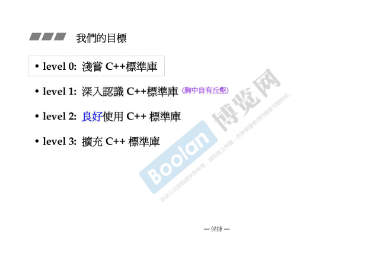
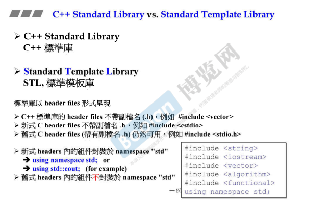

## 导言

**泛型编程**：Generic Programming，主要使用 template（模板）为主要工具编写程序。

> 在本系列课程会解释泛型编程与面向对象编程的差异。

而该系列课程最精髓的部分就是根据源码分析 stl。

stl 正式泛型编程最成功的作品，所以本系列课程是通过 stl 介绍泛型编程更深层次的用法。

stl 由 6 大组件组成。本系列课程会详细介绍这些组件。

如上图，本系列课程的目的是从如何使用标准库到良好的去使用标准库，至于扩充部分，则不需要去过多了解。

如上图，在这里侯捷老师解释道：<u>*c++标准库是除了六大组件外，还有一些其他的方法，六大组件被称为 STL。*</u>

这些标准库的文件都是以 **header files** 的形式呈现，所以肯定能看到源代码。

新式的 c++ 标准库的头文件都**不带 .h**，并且都封装于 **namespace std** 中。

一些重要的查询网页：

> https://cplusplus.com/
>
> https://en.cppreference.com/w/
>
> https://gcc.gnu.org/

