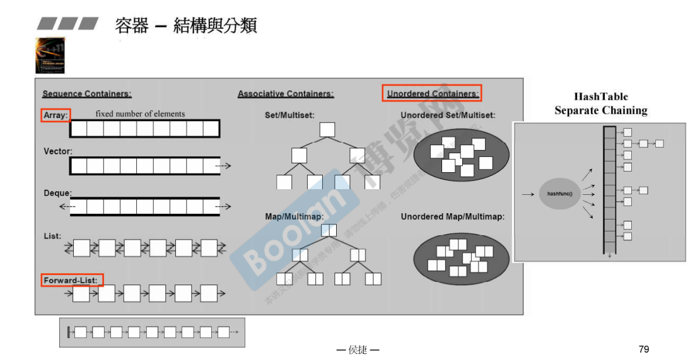
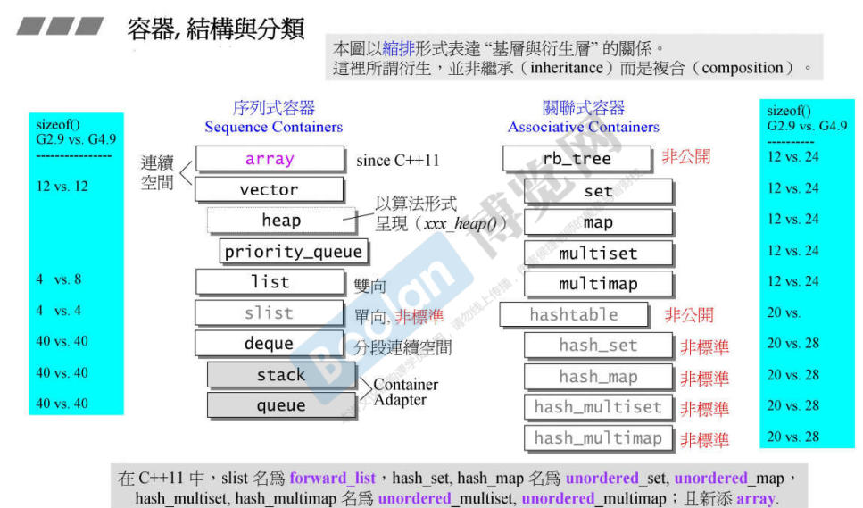

## 简介

在 [3.容器的分类](3.容器的分类) 中，介绍了不同的容器的底层实现基于的数据结构，如下图。

另外，这里再延申并整理这些内容。

如上图，这些是大部分容器的关系。

其中，缩进表示 <u>***基层与衍生层***</u> 的关系，<u>*例如：stack，queue 的 底层是deque*</u>。这层关系**不是继承，而是复合** （c++ 面向对象高级开发 part1.11.组合与继承）。

<u>*在上图的**最左侧**和**最右侧**蓝色部分*</u>，标识了容器的大小，**这个大小跟元素的大小和个数无关**。

