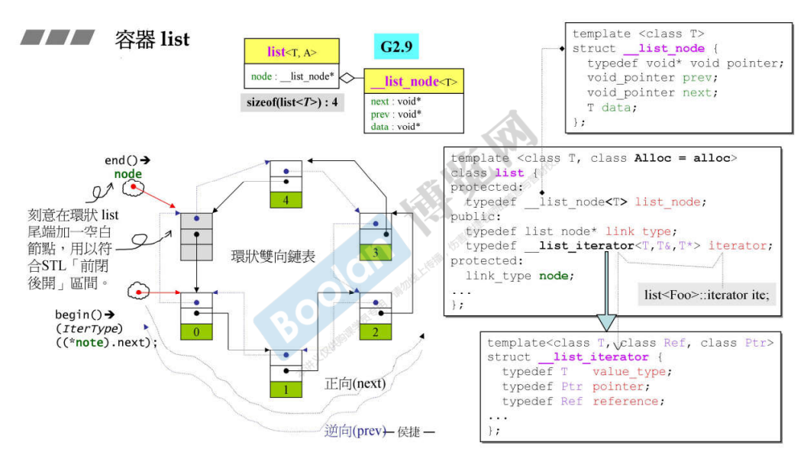
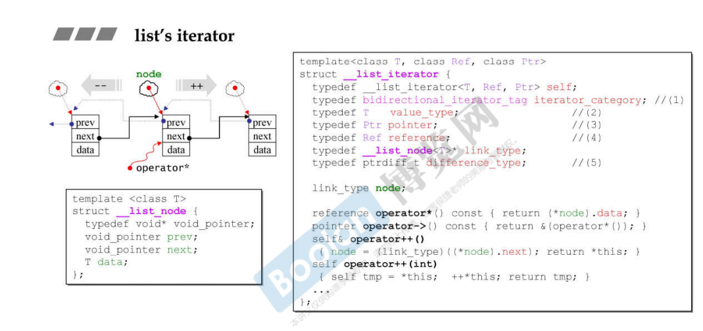
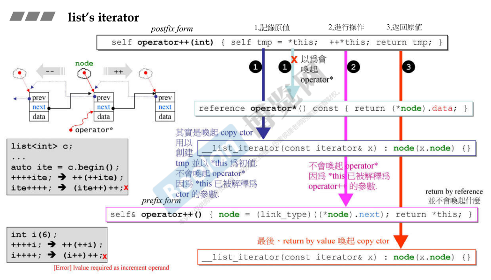
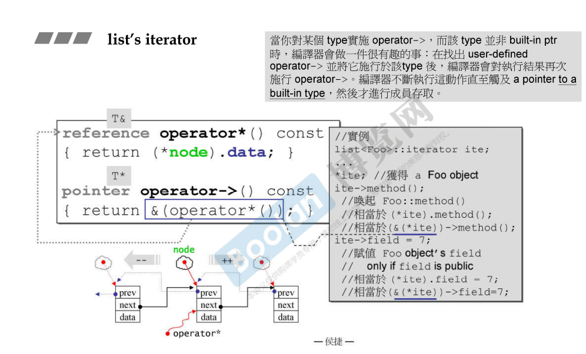
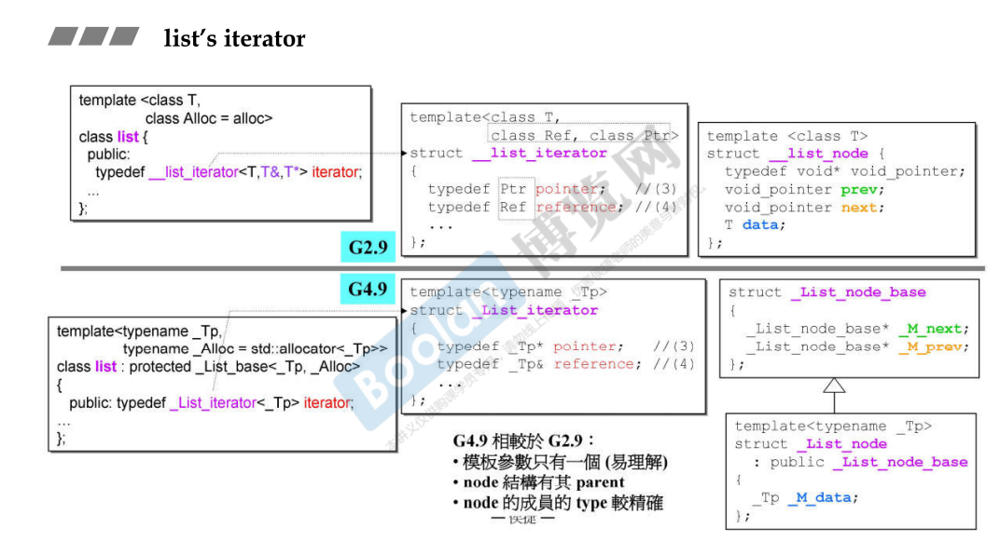
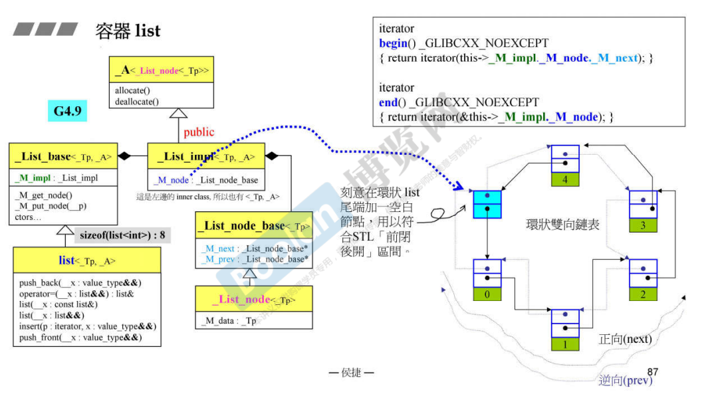

## 简介

list 是所有容器中，虽然不是最简单的（array、vector），但是是最具有代表性的。

链表应该是在学生生涯中学习的第一种数据结构。

本节课程着重介绍 list。

## 实现

### 双向链表

如上图，整个数据成员（data）只有一个 **node**，它是一个指针，大小为 4 个字节（32位）。所以一个 list 的大下为 4。

这个 node 的类型是 __list_node ，是一个带有**两根指针**和**一个data对象**，大小为 <u>*4 + 4 + 类型大小*</u>，所以 list 容器在向分配器请求内存时，会根据这个大小去请求。<u>*这是一个双向链表的节点。*</u>

> *这 gnu c 2.9中，__list_node 的指针类型是 **void** ，这样比较不好，**链表节点的指针类型应该为自身，否则可以指向任何节点**。*

另外，上图中有一个灰色的节点，这里解释为空白节点，这是为了去复合 STL 的前闭后开区间。[2. STL体系结构基础介绍](2. STL体系结构基础介绍) 的 <u>*特殊概念->左闭右开 标签*</u>

### 迭代器

在上图中，迭代器 iterator 为一个泡泡形状的图形。

在源代码中，iterator **是一个对象而非指针**：

> **若 iterator 是一个指针**，由于 **list 不是一块连续的空间**，当**执行 ++ 的动作时，已经不知道指向的位置在哪**。
>
> 所以需要声明为一个对象，并且这个对象可以模拟指针。（c++ 面向对象高级开发 part2.3.像指针的类）在 ++ 时访问 list 的下一个元素。
>
> <u>***在所有的容器（除了 vector 和 array）之外，iterator 必须是个对象，而非指针。***</u>

如上图，由于 iterator 需要模拟指针，所以需要去进行大量的操作符重载（解引用、箭头、++、--、+=、-= 等指针操作）。

<u>*可以看到，iterator 的 ++ 有两个版本，一个版本有参数，另一个版本没有参数。*</u>

如上图，针对于 iterator 的 ++ 操作。

++ 有前后置型，例如：i++ 为 后置型，++i 为 前置型。无论是哪种型，++ 操作的唯一参数为自身（i）。<u>***为了区分这两种类型，前置时操作符重载没有参数，后置时则会有参数。***</u> 

> *这个参数没有任何意义，只是为了区分而已。*

回到迭代器本身，<u>***当执行 ++ 操作（前置）时：***</u>

> 先执行 ++ 操作：
>
> ​	将拥有的 node 指针，指向 next （下一个）node
>
> 再将自身进行返回。

<u>***当执行后置 ++ 操作时：***</u>

> 先将自身进行存储：
>
> ​	标记原值：在 *this 时，其实并不会调用 operator\*()，在这之前，<u>**编译器更早的接收到 = 赋值运算符，这时会先触发拷贝构造函数**</u>。
>
> ​	**以此类推，当 ++*this 时，也不会唤起解引用操作符，而是先执行前置++**
>
> 再执行 ++ 操作。
>
> 最后返回存储的值：
>
> ​	*<u>这里是一个值返回</u>*，而前置 ++ 是个引用返回，可以参考（c++ 面向对象高级开发 part1.3.类成员函数参数传递和返回值）
>
> ​	这样设计就会导致**无法进行连续的 后置++**（上图左下），当然，整数 int 类型也无法进行该操作，这种设计是一种对 int 的模拟。

另外，通过解引用可以获取 node的 data 属性。

在 list 迭代器的使用层面，如上图，<u>使用 解引用 * 和 箭头操作符 -> 来获取 node 的 data 部分内容。</u>

### 新版本迭代

如上图，gnu c 4.9 解决了 2.9 的一些问题，例如上述所说的链表节点指针类型是 void 的问题。

又例如，迭代器在 2.9 中需要传三个模板参数（T，T&，T*），类型、引用以及指针，但更新之后只需要传入一个类型即可。

> <u>*目前看来，gnu c 4.9 的版本应该是可以对标 vc 新版本的*</u> 
>
> 吗？

上图是 gnu c 4.9 list 的实现，各种组合和继承，已经开始头昏脑胀要晕掉了😵

> *这里侯捷老师也吐槽整个新版本的复杂性*
>
> *也说其实根据 2.9 版本来理解 list 的实现即可*

