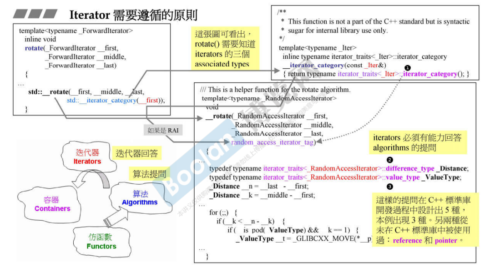
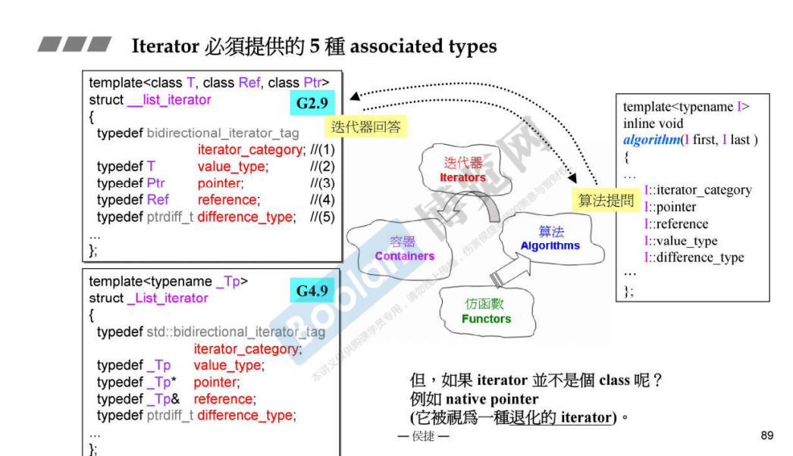
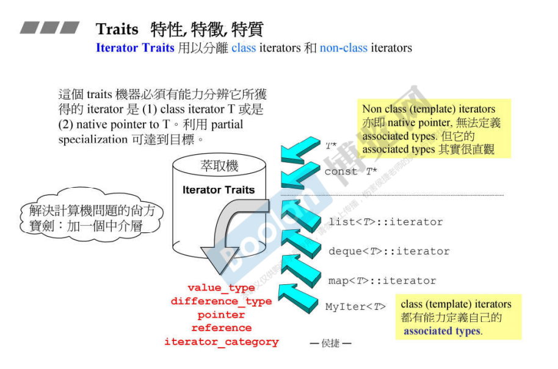
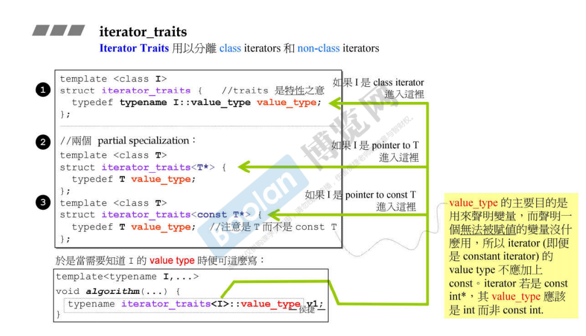
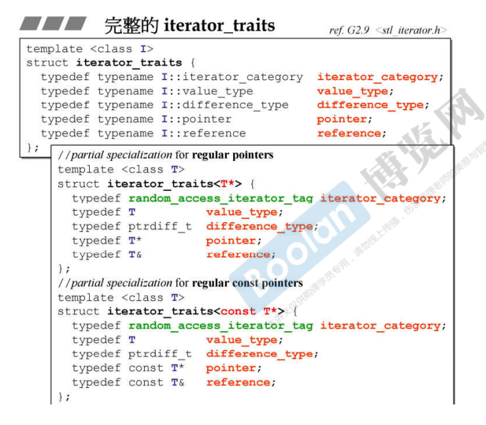

## 简介

如标题，这里的 Traits 指的是特征、特性的意思。

> *在这里，侯捷老师解释说这是人为制造的一种萃取机，将某些特征个萃取出来。*
>
> 针对不同的类型，会有不同的 traits，在本节课介绍的是 iterator 的 traits

## Iterator 特性

如上图，<u>*左下角*</u>，Iterator 是容器和算法的桥梁，**让算法在运算的过程中获取容器的范围**。

在算法操作容器的过程中，可能会需要某些动作来操作元素，这时候需要通过迭代器的某些特性，来对容器中的元素进行操作。

如上图，左上角的 **rotate** 函数，在使用时，调用了 **std::__iterator_category** 方法，这个函数获取了 iterator_traits（**序号①**萃取机），来获取 Iterator 的种类。

> 在这里，侯捷老师解释说：*这里 Iterator 有很多的 category，有些只能一直向前（++），有些可以向后（--），还有一些可以跳着走（+=）*。

另外，如上图的 **序号③** 的 <u>*value_type*</u>，是通过 Iterator 来<u>*萃取容器中的元素类型*</u>；

以及 **序号②** 的 <u>*different_type*</u>，是指<u>*两个 Iterator 的距离使用的类型*</u>，如 unsigned int，则表示为 2 ^ 32 长度。

回到 **rotate** 这个函数，这个函数需要获取 Iterator 的三个特性，通过 Iterator_traits 来获取。

在标准库中的 Iterator 中有五中特性（如下图）：

> iterator_category、value_type、different_type、reference、pointer
>
> <u>***在标准库中，没有任何算法使用到最后面两种特性。***</u>

> 其实在 [11.深度探索list](11.深度探索list) 的 <u>*迭代器*</u> 标签下也有类似的图。

再补充两点：

> 1.difference_type：实际上是一个 unsigned long
>
> 2.iterator_category，这里使用了 bidirectional_iterator_tag，说明该迭代器是一个双向迭代器（list_iterator）

可以从上图中看到，当算法去获取迭代器的各种特性时，其实可以直接访问（<u>*右半部分*</u>），没必要用到 iterator_traits。

## iterator_traits

当算法接收的是一个指针，而非一个迭代器（泛化指针）时，是无法直接获取迭代器的五大特性。

所以需要一个萃取机（traits），如上图，**来分别传入的是一个<u>*类型的对象*</u>还是一个<u>*类型的指针*</u>**。

具体实现是通过模板的偏特化（<u>*c++面向对象高级开发 part2.6.模板*</u>），来区分这两种类型，如下图。

在上图中，当算法需要知道 iterator 的五种特性时，会来询问 iterator_traits（<u>*最下面*</u>）。

而通过 traits，其实也是去访问 iterator，例如访问 value_type 时，当传入的是一个对象时，则会走到 **序号①**；当传入的是个指针时，<u>*由于 iterator_traits 做了关于指针的模板偏特化*</u>，则会走到 **序号②/③**。

**注意：<u>*value_type 主要是用来声明变量用的*</u>，所以在 <u>*const T* 的偏特化中*</u>，如果<u>*返回的是 const T*</u>，一个<u>*无法赋值*</u>的变量是没有什么用的，所以返回的不是 const T。**

> 这种设计其实是通过一个中间层（traits），再利用模板偏特化，来得到结果。

如上图，展示了除了 value_type 以外的其他四个特性如何获取。

可以看到指针类型的偏特化的 iterator_category 是 random_access_iterator_tag，<u>*随机访问迭代器*</u>。

ptrdiff_t 则为 unsigned long。

