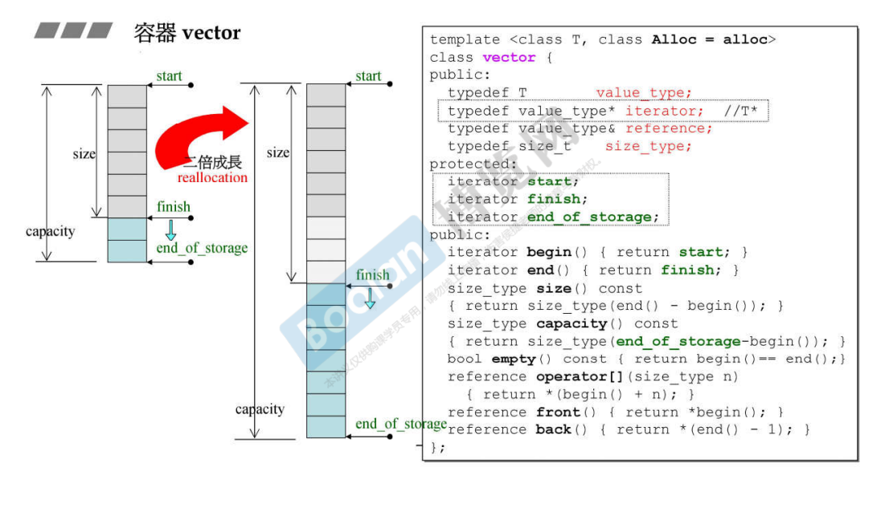
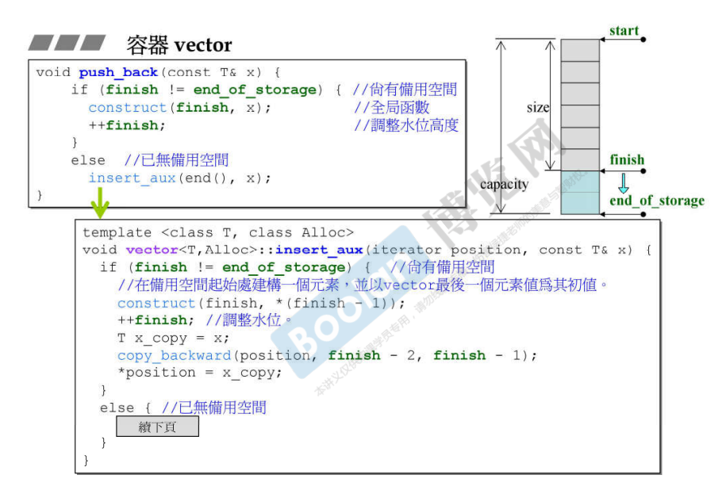
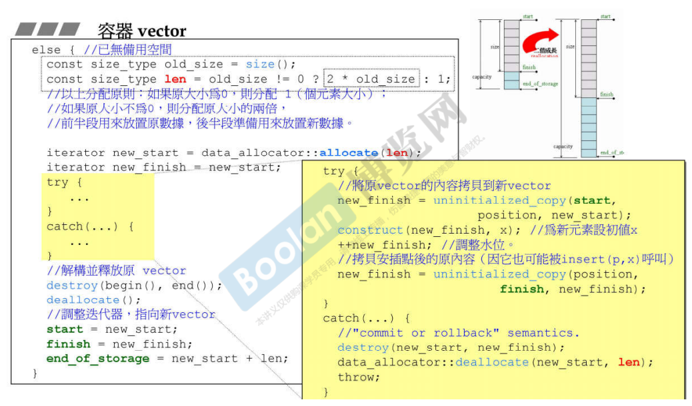
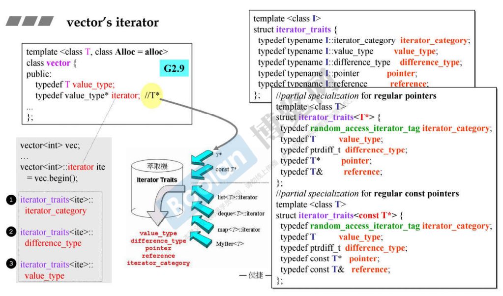
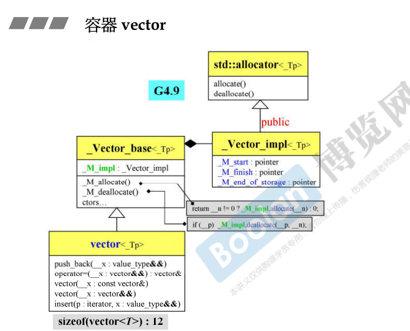
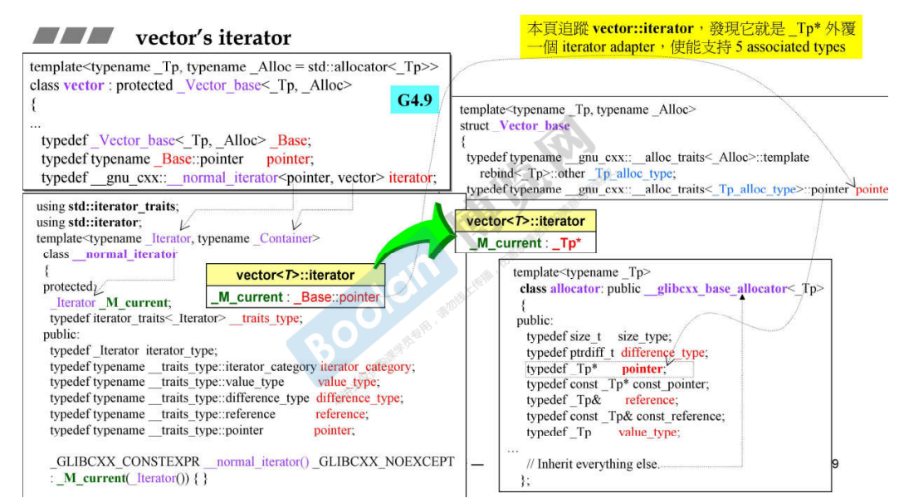
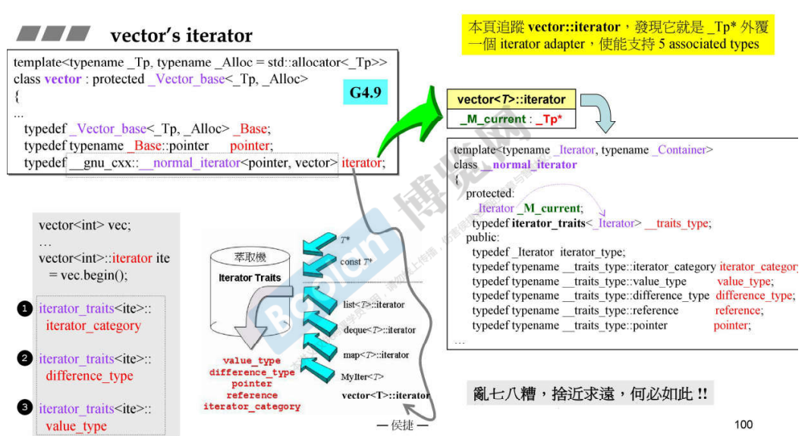

## 简介

vector 是一个动态增长的数组（array）

vector 的实现类似一个数组，当数组的容量不够时，会自动扩充。但是，在一段内存中，是**不可能进行原地扩充**的，它后面的内存有可能被使用。所以在扩充时，只能**去别的地方重新再获取一块扩充过的内存**，**再将原来的数据搬到这块新的内存中进行存放**。

## 对应实现



如上图，在 vector 中有三个变量：**start**、**finish**、**end_of_storage** 来记录着这个 vector 的信息。

当元素的个数超过 vector 的容量时，vector 会进行两倍增长，（[4.容器相关测试(顺序容器)](4.容器相关测试(顺序容器)) 的 <u>*vector 标签下*</u>）。当内存中没有两倍大的空间时，则不会去增长了。

在上图中可以看到，vector 由三根指针（**start**、**finish**、**end_of_storage**）构成，32位中大小为 3 * 4 = 12 个字节。

> **start**：指向首个元素的<u>***指针***</u>，vector 的头部，使用 **begin()** 方法获取。
>
> **finish**：指向末尾元素的下一个元素的<u>***指针***</u>，符合左开右闭的原则 [2. STL体系结构基础介绍](2. STL体系结构基础介绍) 中的<u>*左开右闭标签下*</u>，使用 **end()** 方法获取。
>
> **size()**：容器中元素个数，为 **finish - start**。
>
> **capacity()**：vector 的 **容量**，表示目前可以容纳的元素个数，为 **end_of_storage - start**
>
> **empty()**：比较 begin() 和 end() 是否相等。
>
> **operator []**

### 指针操作

```C++
int a = 0;
int* pa = &a;
int* pb = pa + 1;	//指向 pa 的下一个内存地址 (int 为 4 个字节, 应该 +4)
std::cout << pb - pa << std::endl;	// 1
```

如上述示例代码，<u>*pa 指向 a，pb 指向 pa 的下一个内存地址*</u>

由于 <u>*pb 为 int 类型指针，地址应该 +4*</u>，但是**在 pb - pa 时，结果为 1**。

> 这里合理的解释（笔者推测）：只能说指针相减的结果，<u>*并不是字节相差的个数（地址距离）*</u>；**而是编译器会将<u>*得到的地址的差值（地址距离）*</u>，<u>*再除以指针指向的类型（int，除以4）*</u>，最终得到真正的结果（偏移量）**。
>
> 所以在上述 vector 的指针操作中，**size()** 以及 **capacity()** 方法得到的是**指针的偏移量**，而不是地址距离。

### 两倍增长



如上图，两倍增长是发生在添加元素的时候，这里使用 **push_back()** 方法作为例子。

可以看到，在使用该方法时，会判断 finish 和 end_of_storage 是否相等：

> 当**不等**时，表示尚有备用空间，构造元素，并且调整 finish 位置。
>
> 当**相等**时，表示没有备用空间，则会进行 insert_aux 操作。

下面来看看相等时（即没有备用空间）的操作，如下图：



首先，会进行计算新的空间大小，<u>*当空间为 0 时，则分配一个空间（否则 0 的两倍也是 0，相当于没分配）*</u>；<u>*当空间不为 0 时，则进行两倍增长*</u>，并且**得到分配的内存空间地址**（**new_start**，使用 allocate 方法 [6.分配器测试](6.分配器测试) 中的<u>*使用分配器标签下*</u>）。

然后，**将原来的元素拷贝到新的内存中，并且构造添加的元素（push_back()）**，另外，考虑到不只是 push_back() 会增长空间，**insert()方法也会造成空间增长，所以需要将尾部的元素也进行拷贝**。

最后，<u>*将原本空间的元素进行销毁*</u>。

> <u>*vector 在每次成长时，会大量调用元素的**拷贝构造**和**析构函数**，造成很大的开销。*</u>

## vector 的迭代器



如上图，由于 vector 的元素在空间上是连续的，所以**只需要用指针就足够了**，在 [12. 迭代器的设计原则和iterator_traits的作用与设计](12. 迭代器的设计原则和iterator_traits的作用与设计) 的 iterator_traits 下有提到。

同样的，iterator_traits 在被 algorithm 调用，来询问 iterator 的各种特性时，在<u>*上图中（右半）*</u>或者<u>*上述文档*</u>中都有提到。相当于是对 iterator_traits 做一个示例，**针对于指针层面的迭代器**。

## 新版本（吐槽）



如上图，这是侯捷老师截取的 gnu c 4.9 版本的 vector 的类图。

> *<u>在这里，侯捷老师特别吐槽 **public** 继承，表示该继承方式表示 **子类 is-a 父类**，但这里显然不能表示，若想使用 allocator 的功能，**用 private 继承即可***</u>
>
> （c++ 面向对象高级开发 part1.11.组合与继承）



另外，迭代器也搞得很复杂😓。

> 侯捷老师也同样吐槽：<u>*新版本可能觉得复杂是一种美，但其实我们这边感觉很丑*</u>😂

如上图，绕了很大一圈，发现其实就是一个 Tp*，一个指针而已。

