## 简介

deque，双向队列，在内存结构上，是一段双向开口的空间，如下图右上角。

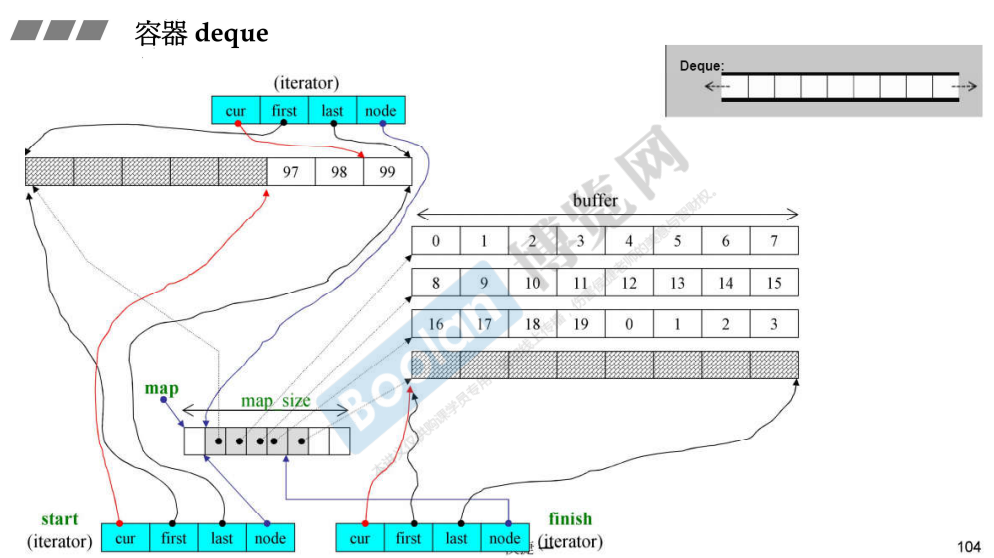

如上图，同时在 [4.容器相关测试(顺序容器)](4.容器相关测试(顺序容器)) 的 <u>*deque 标签下*</u> ，也有对 deque 结构的图例。

deque 的底层结构是通过分段（buffer），并且将这些内存段串接起来，在使用时看起来是连续的，但实际上是**分段连续**。

<u>***串接的部分是一个 vector，里面的每个元素是一个指针，每个指针分别指向各个 buffer，buffer其实也是一个数组。***</u>

> <u>*当 map 扩充时，同样是两倍扩充，但是时将元素 copy 到中段。*</u>

<u>***当 deque 中的 buffer 全部被占用时，需要重新分配一个 buffer，并且通过指针进行串联。***</u>

deque 的迭代器是一个 class（上图蓝色部分 iterator），分别由 **cur、first、last、node** 四个指针构成：

> **node**：指向 "控制中心" 的一个分段（buffer）
>
> **first** / **last**：指向 node （buffer）的 头 / 尾，标识出 buffer 的边界，当然也是<u>*前闭后开*</u>区间。
>
> **cur**：指向当前访问的元素，当 cur 移动到 last （或者 first）时，为了维持连续的假象，iterator 则会去指向下一个（或者前一个）缓冲区（通过 node 回到 "控制中心"）。

当然，在上图中，类似其他的容器，<u>*deque 还维护着两个迭代器*</u>，**头 / 尾**（start / finish）

## 具体实现

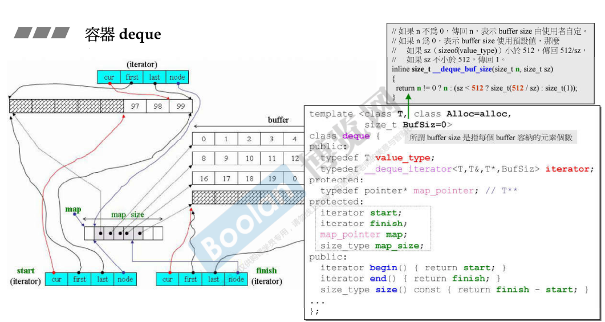

如上图，在 deque 中，有四个成员：**start、finish、map、map_size**

> map 是一个指向指针的指针，其实就是上述的 vector 中的指针。
>
> start 和 finish是迭代器，简介中有提到，一个 deque 的迭代器有四个指针，大小为 16 个字节。
>
> 所以，整个 deque 的大小为 16 * 2 + 4 + 4 = 40 个字节。

另外，关于模板参数部分，缓冲区（buffer）的大小 BufSiz 默认为 0，但其实不是的，这里表示使用默认的 buffer 大小。在上图中（<u>*右上角*</u>），会根据类型的大小进行判断： < 512 时返回 512 / sz ； > 512 时返回 1。

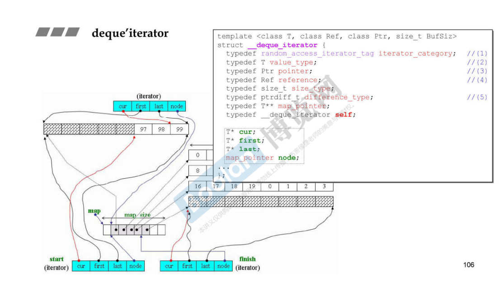

上图是关于 deque 的迭代器部分源代码，是对上述简介进行补充。

根据迭代器的定义，每种关于类型的迭代器都是需要声明五个特性的 [12. 迭代器的设计原则和iterator_traits的作用与设计](12. 迭代器的设计原则和iterator_traits的作用与设计)。

### insert

这里挑了一个特别的函数 insert，来展示 deque 的如何控制自身的分段内存（cur、node...）。

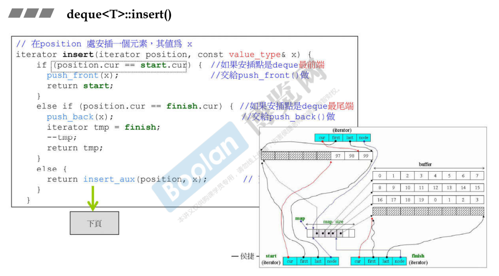

如上图，insert 为指定一个位置，并且插入新的元素。

在<u>*顺序存储的内存结构*</u>中，想要**插入一个元素**，必须<u>*对元素进行推动*</u>，例如 vector 的 insert，它需要将元素向后推动。

而 deque 的 insert 设计的很巧妙，<u>***他会判断传入的位置距离 头 / 尾 哪个比较近，再去将元素 向前 / 向后推动。***</u>

<u>*先判断是否在 **头** / **尾** 两端，是的话直接调用 **push_front()** / **push_back()**。*</u>

否则如下图：

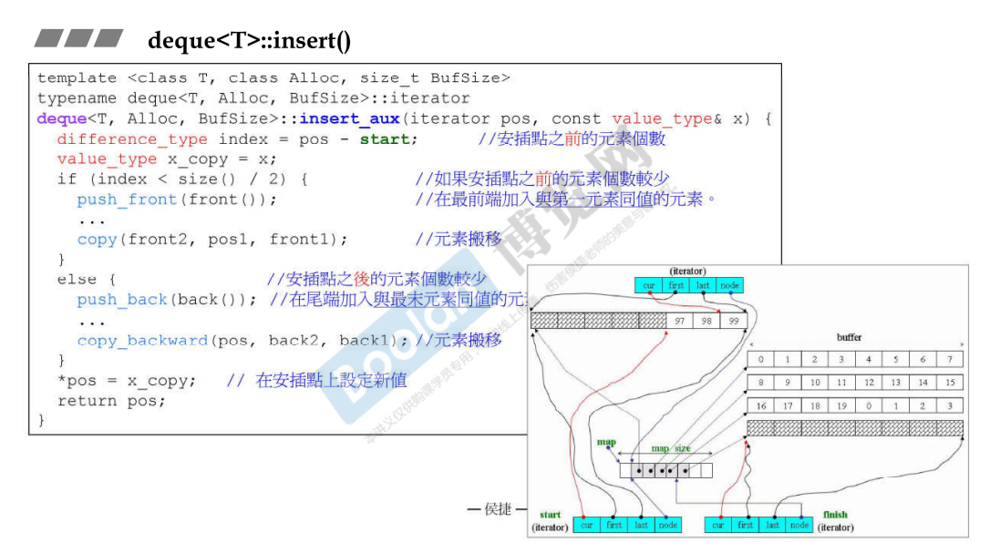

调用 insert_aux，判断距离 头 / 尾 哪个比较短，然后往比较短的那一端推动。

> <u>*这边调用 **push_front()** / **push_back()** 是为了**在 buffer 不够用时，重新分配 buffer**。*</u>

### 模拟连续空间

> <u>*deque 能够去模拟连续的空间，都是迭代器的功劳。*</u>

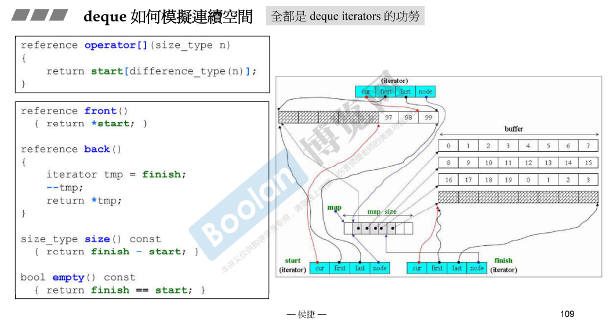

如上图，先不看具体的迭代器操作，先看 deque 的一些方法。

> **front()**：传回 start，首个元素。
>
> **back()**：由于 finish 指向最后一个元素的下一个元素，所以传回的是 finish 的上一个元素，末端元素。
>
> **size()**：finish - start，这个操作符重载，会得到 start 到 finish 的距离，会将中途的 buffer 中的元素个数和当前buffer 的元素个数相加，得到所有的元素个数。
>
> **empty()**：判断 finish == start。

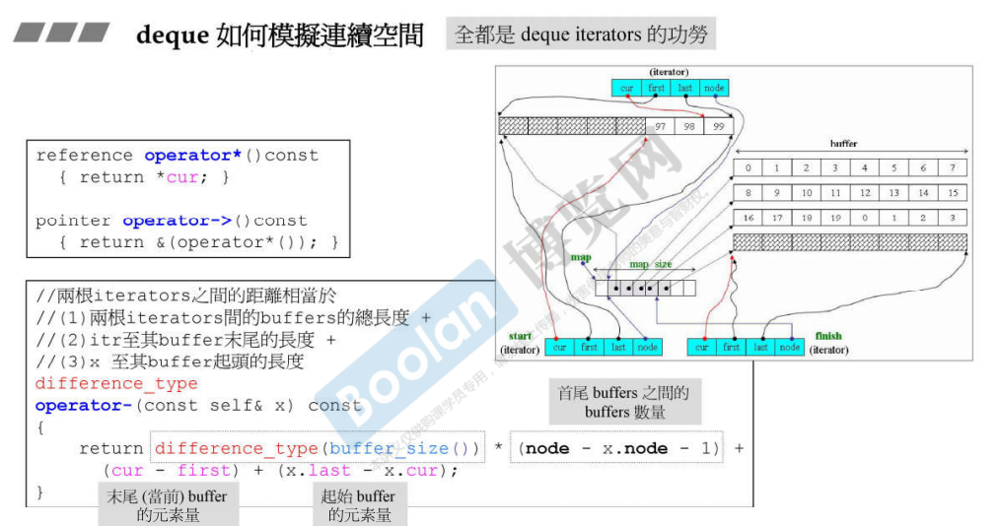

如上图，**解引用和箭头操作符是将 cur 节点取出**。

另外，**operator-** 减法操作符：

> 先计算<u>*两个迭代器之间有多少个 buffer*</u>，即 **node 相减**，简介上提到，node 指向控制中心，相减得到 node 的距离。
>
> 另外再计算每个迭代器中的元素数量。

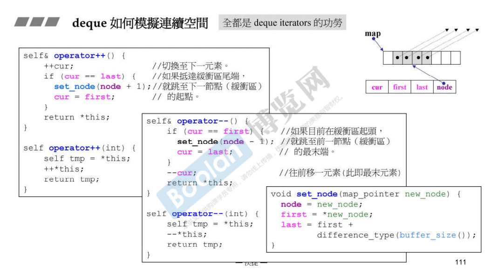

同样的，可以看到相应的 前后 ++ / -- 操作，[11.深度探索list](11.深度探索list) 的 <u>*迭代器标签下*</u> 有详细介绍。

> <u>*使用**后置 ++ / -- 调用 前置 ++ / --***</u>

具体的操作：

> 1.判断迭代器的 cur 是否已经移动到 buffer 的 末端 / 首段 （last / first），然后去移动 node。
>
> 2.设置 cur / first / last。

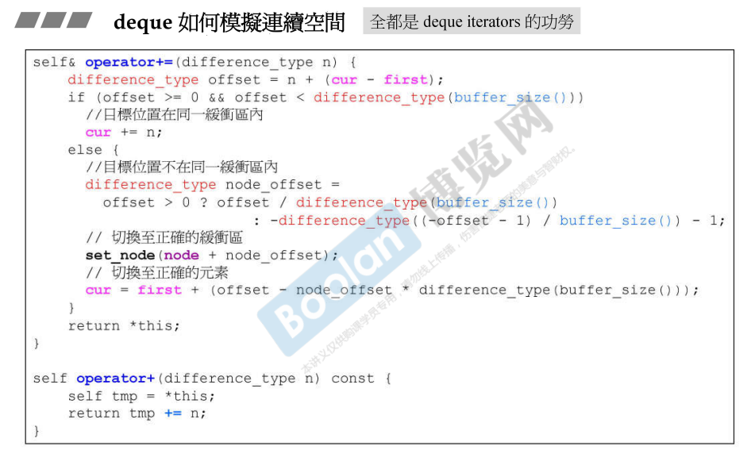

同样的，deque 看似连续，所以也提供 += / + 来让迭代器进行随机访问，如上图。

> 当不跨越缓冲区（buffer）时，只需要移动 cur 即可。
>
> 当跨越缓冲区时，则需要根据 buffer size 计算跨越了多少缓冲区，需要回到控制中心（node），切换至正确的缓冲区，然后进行 cur 设置。

当然，-= / - 也是一样的，使用 += / + 即可，如下图。

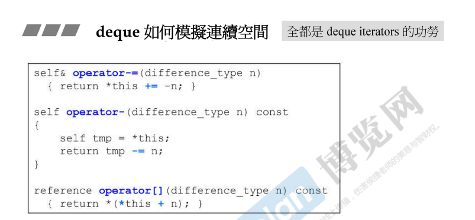

中括号操作符 operator[] 则是通过 迭代器 去获取元素。

## 新版本

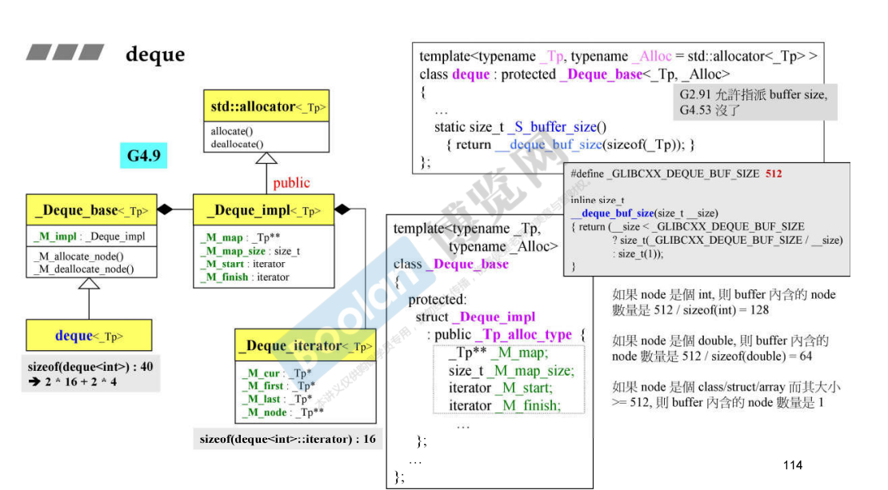

最大的区别应该是不能够去设置缓冲区（buffer）的大小。