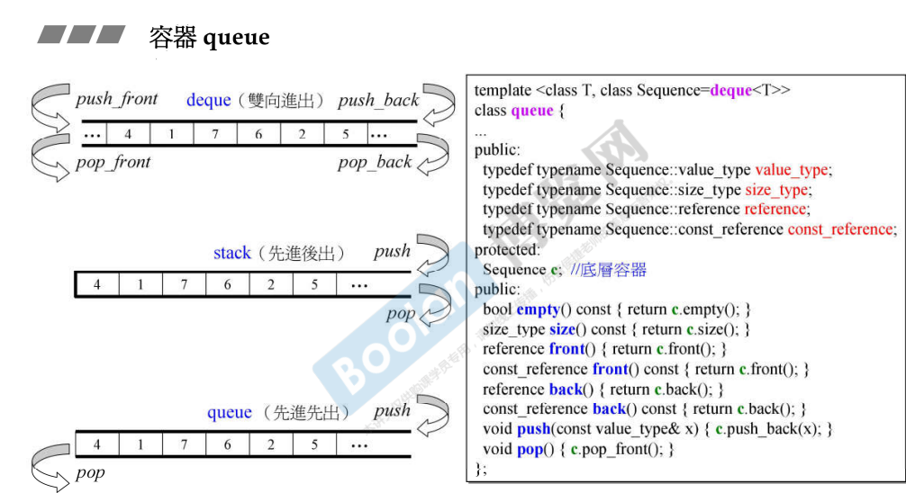
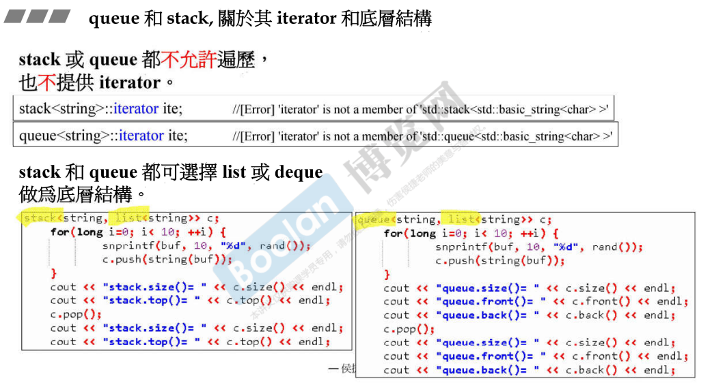
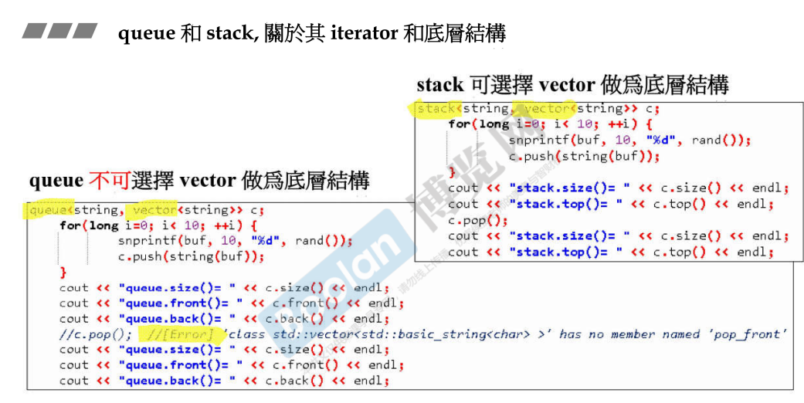

## 简介

queue、stack 的特性分别是 先进先出 / 先进后出。

如上图，可以看到 queue、stack 可以不必去重写 push、pop 的操作，只需要内含一个 deque 即可实现这些功能。该容器双向开口，deque 可以完全满足。

另外，queue、stack 不支持也不提供迭代器。

而且可以使用 list 容器来做底部支撑。

可以做 queue、stack 的容器必须拥有最上面两张图中的 Sequence 中调用的方法（push_back、push_front...等）。

例如，vector 可以作为 stack 的底部支撑，然而不能作为 queue 的底部支撑（没有 pop_front 方法）

