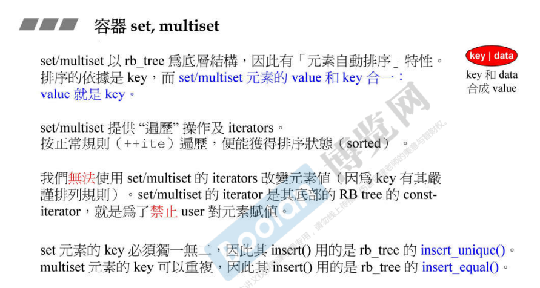
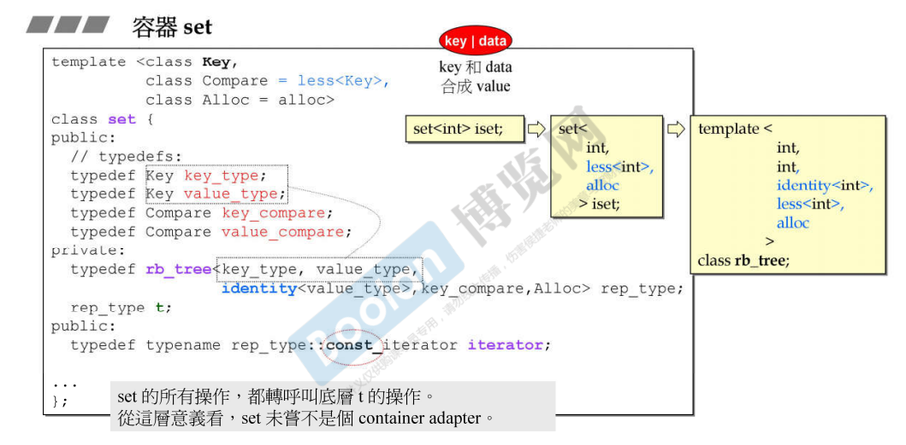
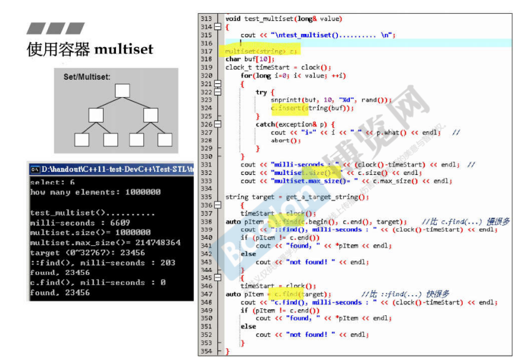

## 简介

如上图，set / multiset 底层基于 rb_tree（红黑树）来实现，所以容器中的元素自带顺序。排序的依据是 key，而 <u>***set / multiset 元素的 value 和 key 合一：value 就是 key***</u>。

可以使用迭代器 iterator 来获取（遍历元素），并且通过 iter++ 来进行顺序遍历。但是我们**无法使用 iterator 来改变元素**，在 [17.RB-tree 深度探索](17.RB-tree 深度探索) 中的简介部分提到，<u>***关于红黑树的 iterator，理论上不应该更改元素，但是 STL 没有进行限制***</u>。<u>***而 set / multiset 的设计禁止了使用者对元素赋值***</u>。

另外：

> [17.RB-tree 深度探索](17.RB-tree 深度探索) 中的<u>*使用*</u>部分：
>
> **set** 元素 key 唯一，所以 **insert()** 调用的是 rb_tree 的 **insert_unique()**
>
> **multiset** 元素 key 可以重复，所以 **insert()** 调用的是 rb_tree 的 **insert_equal()**

## 实现部分

如上图，可以看到，set 中内含一个红黑树 rb_tree（rep_type）。

模板参数部分：

> **Key**：指的是 set 中元素的类型。
>
> ​	实际影响了红黑树的 key_type 和 value_type 部分（**set 的 key 和 value 合一**），并且通过**identity<>** （[17.RB-tree 深度探索](17.RB-tree 深度探索) 中的<u>*使用*</u>部分）模板函数，<u>*从实际值 value 中获取 key*</u>。
>
> **Compare**：比较该类型对象大小的函数。

获取 set 的**迭代器**时，是获取的 rb_tree 的 **const_iterator**，如上图，这个常量的迭代器不能够去改变容器中的元素，只能够获取。

可以看到，set 的所有操作，都是呼叫底层的 t（红黑树） 的操作（<u>*上图最下灰色底部*</u>），类似的： stack、queue 也是呼叫底层容器 deque 的操作。

### vc6 版本

在没有 identity<> 的情况下，在 set 类中有一个 _Kfn 结构体，这个结构体的行为像一个函数（**operator()**），来代替 identity<>。

### multiset

在 [5.容器相关测试(关联容器)](5.容器相关测试(关联容器)) 的测试中，已经详细使用过了 multiset，如下图。

