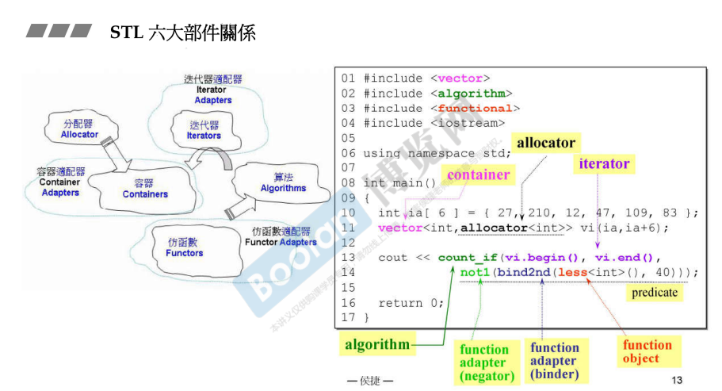
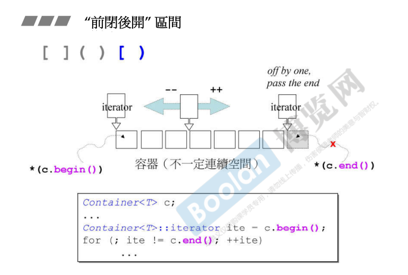
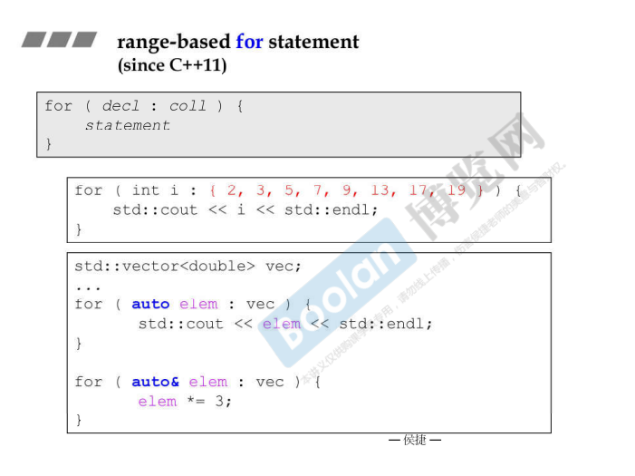
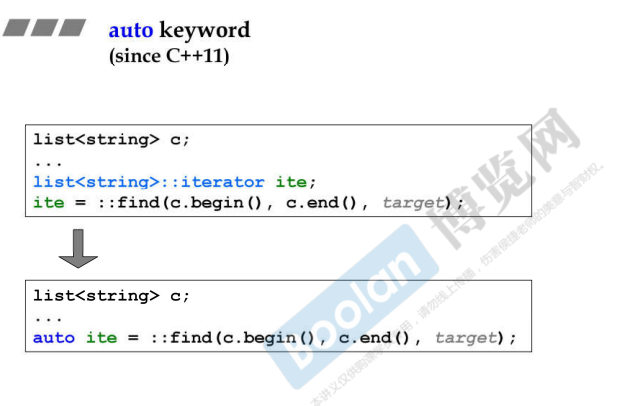

## 简介


如上图，c++标准库中 STL 部分是由上述六大部分组成

> <u>*容器、分配器、算法、迭代器、适配器、仿函数*</u>

**其中，<u>*容器*</u>和<u>*算法*</u>最为重要。**

这六大组件的关系：

> 容器（Container）需要放置数据，所以需要内存分配，这时分配器（Allocator）就开始发挥作用；
>
> 当操作容器时，除了容器中自带的一些操作，一些进阶的操作则需要算法（Algorithms）；
>
> 算法（Algorithms）需要处理容器中的数据，那么需要去访问容器中的元素，则迭代器（Iterator）就作为桥梁，让算法去访问元素；
>
> 仿函数（Functor）则是处理对象之间的某些算法（参考 c++面向对象高级 part2.4.像函数的类）

## 具体使用



如上图，这一小段代码使用了 6 大部件。

```C++
#include <vector>
#include <algorithm>
#include <functional>
#include <iostream>

using namespace std;

int main {
    int ia[6] = {/*...*/};
    /*
    * 使用容器 vector, 并且指定元素类型 int
    * 使用分配器 allocator, 一般不需要写, 会有默认的分配器
    * 若 allocator 分配的类型和 vector 的元素类型不匹配, 这是一件不合理的事情。
    */
    vector< int, allocator<int>> vi (ia, ia + 6);
    
    /*
    * 使用 count_if 算法来操作容器, 即计算某个条件的元素总和
    * 该算法需要指定元素的范围, 则将容器的 迭代器 [begin, end) 指定给 算法
    * 在这个例子下, 要寻找 >=40 的元素个数: 则去使用 less<int> 仿函数, 然后通过 bind2nd 将第二个参数绑定到 仿函数中。
    意为: less<int> 要小于 40
    * not1 指的是取反, 则会去得到 >=40 的元素
    */
    cout << count_if(vi.begin(), vi.end(), 
                    not1(bind2nd(less<int>(), 40))) << endl;
    
    return 0;
}
```

在上述示例代码中，已经涵盖了很多 STL 的用法，<u>*不用慌，慢慢来~*</u>。

## 特别概念

### 左开右闭



使用迭代器去操作（访问）元素时，需要注意迭代器指向的范围。

如上图，容器的 <u>*begin()*</u> 和 <u>*end()*</u> 分别表示为：<u>*指向第一个元素*</u> 和 <u>*指向最后一个元素的下一个位置*</u>。

> 迭代器作为泛化指针（像指针的类），同样是支持解引用操作，当 end() 解引用时，会取出一个很奇怪的元素（所以不能取）。

另外，迭代器支持遍历，并且是一个像指针的类（c++ 面向对象高级 part2.3.像指针的类），所以<u>*支持 ++ / -- 操作*</u>，并且<u>*该操作是在遍历整个容器*</u>（如下图下半部分）。

### 范围 for 循环 



另外，在 c++11 中，容器也支持范围 for 循环遍历（<u>*如上图最下示例程序*</u>）。

#### 一些衍生

> <u>*如何让自定义的 c++ 类支持范围 for 循环呢？*</u>

根据检索的结果 [博客](https://zhuanlan.zhihu.com/p/351615111)，可以看到能够支持范围 for 循环的类具备以下条件：

> 1. 具有 <u>*begin*</u> 和 <u>*end*</u> 方法，即可以作为成员函数也可以作为独立的函数，函数 <u>*返回数据结构开始和结束的迭代器*</u>。
> 2.  <u>*迭代器*</u> 必须 <u>支持操作符 *，!=，++</u>，即可以作为成员函数也可作为独立函数（详细的信息可以参考操作符重载）。 

### auto



使用 auto 关键字，可以省略声明 迭代器 对象的繁琐写法。

