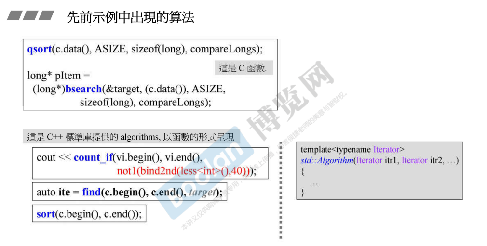
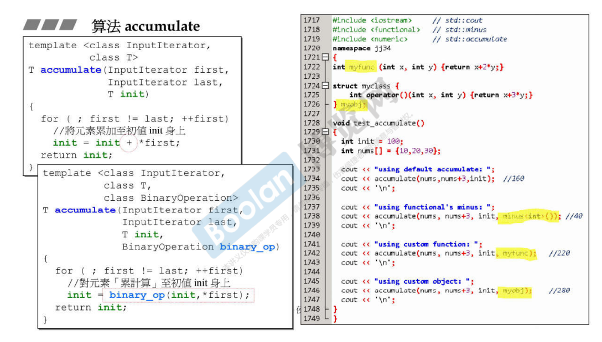
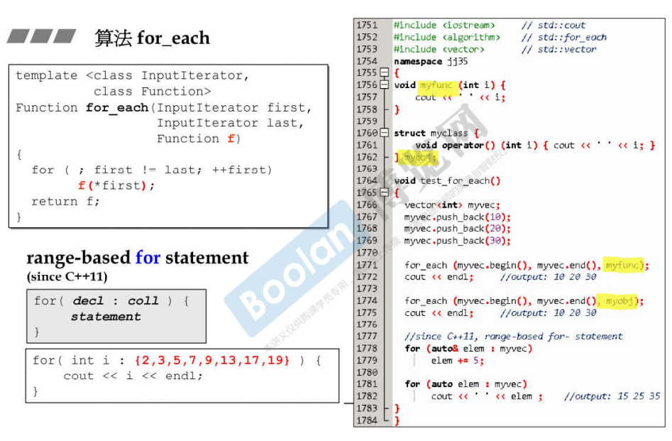
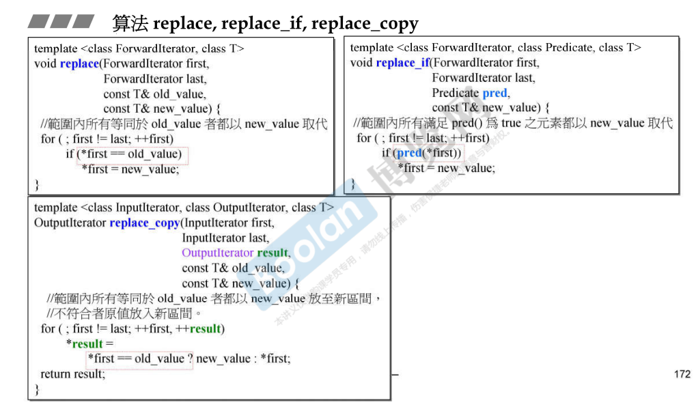
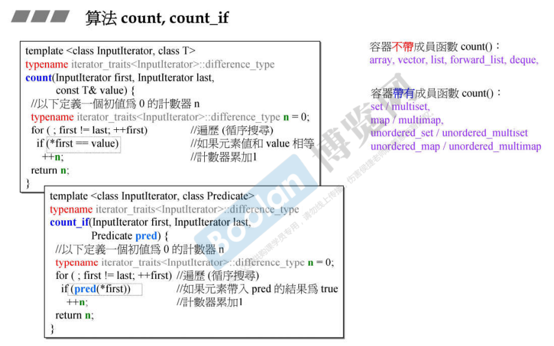
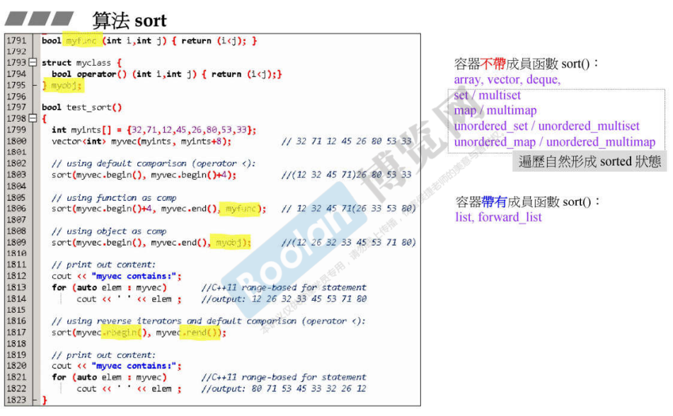
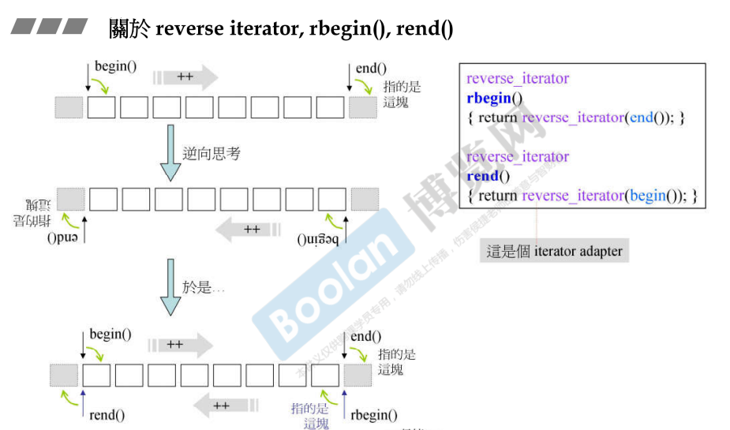
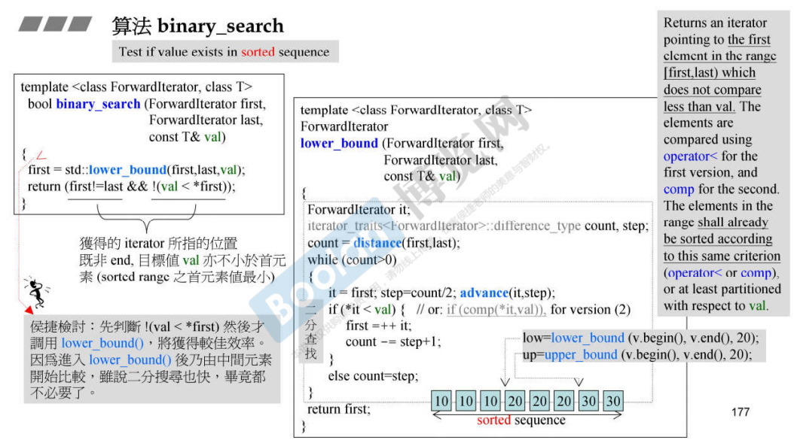

## 简介

在介绍完迭代器的分类 [22.迭代器的分类（category）](22.迭代器的分类（category）) 以及不同分类对算法有何种影响 [23.迭代器分类（category）对算法的影响](23.迭代器分类（category）对算法的影响)。这节课就开始去认识一下算法的内部，但不是真正的去理解算法如何实现，而是去看看 STL 的 algorithm 的使用和设计等。



如上图，展示了 c 函数的算法以及 c++ STL 中的算法。

> *<u>最大的区别是：c++ STL 中的 algorithm 中的各种算法参数肯定是以迭代器的方式进行传入（灰色打底）。</u>*

## accumulate



如上图，**accumulate** 表示一个**累计**（不仅仅为累加，还可以传入自己想要的运算）。

在这里展示了两个版本的 accumulate，参数分别传入：

> 1.**首尾迭代器**，**first / last**，标志容器的范围
>
> 2.**累加数**，**init**，表示将容器范围内元素的值<u>*累加到 init 上*</u>。
>
> 3（可选）.**操作函数**，**binary_op**，表示如何对两个元素进行操作；在算法内部表现为：<u>*将 init 和 容器范围内每个元素进行 binary_op 操作*</u>，**将 init 作为 x（第一参数），将容器内元素作为 y（第二参数）**。

在上图右半部分，展示了如何使用该算法，使用 数组 进行测试，调用了四次 accumulate。由于数组没有迭代器，所以使用指针来代替。**关于指针类型的迭代器部分**，可以参考 [12. 迭代器的设计原则和iterator_traits的作用与设计](12. 迭代器的设计原则和iterator_traits的作用与设计) <u>*iterator_traits标签下的偏特化部分*</u>。

以上的四次调用的 **binary_op**：

> 1.没有传入 binary_op：将元素进行累加，结果添加至 init 上。
>
> 2.**minus<>()**：**减法**，init <u>*对容器中每个元素进行**累减***</u>。100 - 10 - 20 - 30 = 40
>
> 3.**myfunc**：是一个**一般的函数**，init 每次累加 2 * 元素（x + 2 * y）。100 + 10 * 2 + 20 * 2 + 30 * 2 = 220
>
> 4.**myobj**：是个**像函数的类**（c++ 面向对象高级开发.part2.4.像函数的类），将 init 每次累加 3 * 元素（x + 3 * y）。100 + 10 * 3 + 20 * 3 + 30 * 3 = 280

## for_each



如上图，**for_each** 算法是对容器中每一个元素做某件事情。

参数为：

> 1.**首尾迭代器**，**first / last**，标志容器的范围
>
> 2.**Function**，指定每个元素的操作。

传入 <u>*Function*</u> 参数，可指定如何操作元素。例如，在<u>上图右半部分</u>，对每个元素进行打印。

在 c++11 中，使用语法：

```C++
for( decl : coll) {
    statement
}
```

可以进行遍历元素，这种循环其实跟算法中的 for_each 循环一致。

### 范围 for 补充

若想设计一个可以支持范围 for 循环的类，那么这个类必须有以下特性：（可参考 [博客](https://blog.csdn.net/HandsomeHong/article/details/114860082) ）

> 1.拥有 **begin()** / **end()** 方法获取首尾迭代器
>
> 2.迭代器支持 **++ / * /  !=** 操作符（**自增、解引用、不等于**）

## replace、replace_if、replace_copy



如上图，**replace** 算法的解释为：***范围内所有等同于旧值（old_value）的元素，将被新值（new_value）所取代。***

参数为：

> 1.**首尾迭代器**，**first / last**，标志容器的范围
>
> 2.**old_value**：**旧值**，判断元素是否与这个值相等。
>
> 3.**new_value**：**新值**，当元素等于旧值时，使用新值进行替换。

而 **replace_if**，则是多一个**条件**（Predicate），这个参数取代了 old_value，是一个<u>***条件判断，当条件成立，则使用新值替换。***</u>

另外，**replace_copy**，这个算法的参数多了一个 **result** 输出，意为将<u>***等于 old_value 的元素拷贝（copy）到 另外的容器 result 中。***</u>

## count、count_if



如上图，**count** 算法，意为统计出符合传入值 **value** 的元素数量。

参数为：

> 1.**首尾迭代器**，**first / last**，标志容器的范围。
>
> 2.**value**：判断元素是否与该 value 相等。

那么同理，类似于 replace，**count_if** 也是多一个条件参数（Predicate），当元素符合条件，则计数 + 1。

在<u>*上图右半部分*</u>：列举出了容器成员中拥有 count 成员函数的容器，**这些容器都是关联容器（8个）**，<u>***当这些容器需要计数时，应该使用成员 count，而不是使用算法泛化的 count。***</u>

## find、find_if


**find**（上图）算法和 replace、count 类似，不再赘述。

> <u>*同样的，关联容器也包含了 find 成员函数。*</u>

## 关联容器 count、find

> 关联容器中都包含了 count、find 函数，其实这个不难理解。
>
> 关联容器基于自身的 key 去寻找对应的 value。
>
> 无论是基于 红黑树 或者说是基于 哈希表 实现，**都对 key 做了特殊操作（排序、哈希值）**。[17.RB-tree 深度探索](17.RB-tree 深度探索)、[20.hashtable深度探索](20.hashtable深度探索)
>
> 如果使用算法中的 count、find 进行循序查找，势必会浪费了容器对 key 的这些特殊操作，效率会比较低；使用这些容器实现的 count、find 进行操作，那么这些容器利用了这些特殊操作带来的较高的效率。

## sort



如上图，**sort** 算法，很好理解，就是对容器中的元素进行**从小到大**排序。

参数为：

> 1.**首尾迭代器**，**first / last**，标志容器的范围。
>
> 2.**Predicate**（可选）：一个比较元素大小的方法，当元素自身可以进行 **< 操作符** 比较时，则不需要传入；<u>*否则需要进行 operator< 重载，或者传入该参数。*</u>

另外，在<u>*上图左半部分最有一次调用中*</u>：使用了**逆向迭代器** **rbegin()** / **rend()**，那么这个结果就为<u>*逆向的排序结果*</u>。

**注意：**

> 1.关于**关联容器，本身就有顺序**。无论是成员中还是实际使用时，都没有或者说都<u>*不应该去对这些容器的元素进行排序*</u>。
>
> 2.在 **list** / **forward_list** 的成员中，**包含了 sort() 成员方法**。在对这两种容器进行排序时，需要调用成员函数。
>
> ​	这里的原因也很好解释，**算法中的 sort()**，要求的是 **random_access** 的 iterator，迭代器本身可以跳跃，而 list 和 forward 则不行。

## reverser iterator 逆向迭代器



如上图，这是 逆向迭代器 **rbegin()** 和 **rend()** 的示例。

对于 begin() 和 end()，遵循 左闭右开 的原则（如上图）<u>*begin 指向首元素，end 指向末尾元素的下一个位置*</u>，并且在自增操作（++）时，是从 begin 至 end。

那么逆向迭代器也同理，同样是遵循左闭右开原则，begin 和 end 位置互换，<u>*rbegin指向末尾元素，rend则指向首元素的前一个位置*</u>，<u>*自增时方向相反*</u>。

> 在这里侯捷老师并没有详细解释如何实现，只是说：类似上图的右半部分，紫色的 reverse_iterator 是一个 adapter 适配器，是后续的内容。

## binary_search



如上图，**binary_search** 二分查找算法，使用该算法的前提是：<u>***元素必须提前进行排序***</u>。

在这个算法中，使用了 **lower_bound** 方法，这个方法有一个兄弟：**upper_bound**。

> **lower_bound**：该算法获取寻找元素的**最小边界**，<u>*如上图右下角*</u>，查找容器中元素为 20 的元素，该容器中有很多个 20，lower_bound 则会去寻找最小边界。
>
> **upper_bound**：与 lower_bound 相反，获取的是寻找元素的**最大边界**。

> <u>*无论是 lower / upper_bound，这两个方法其实都是二分查找，只是寻找的边界不同。*</u>

**而当没有寻找到元素时，则会返回 end**。

