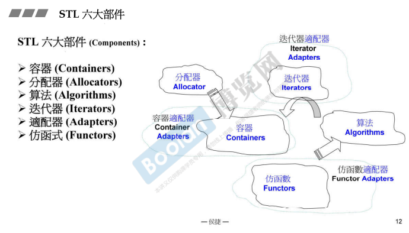
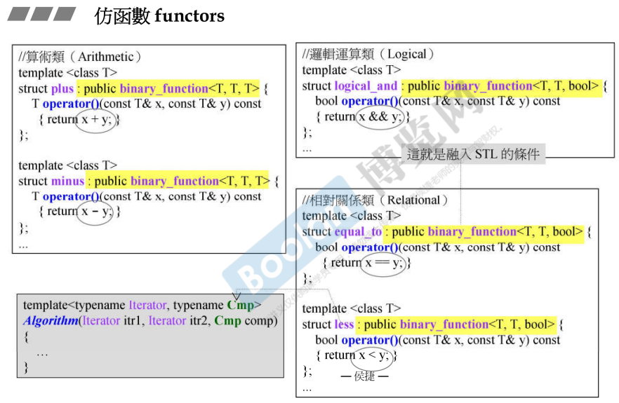
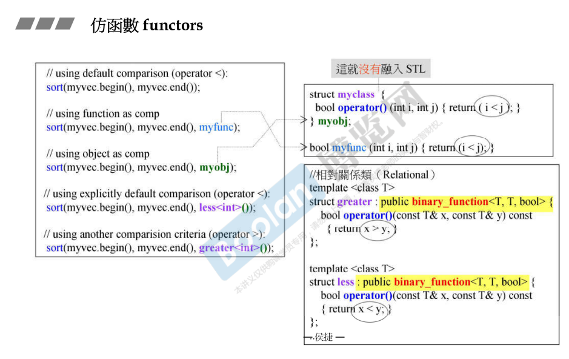
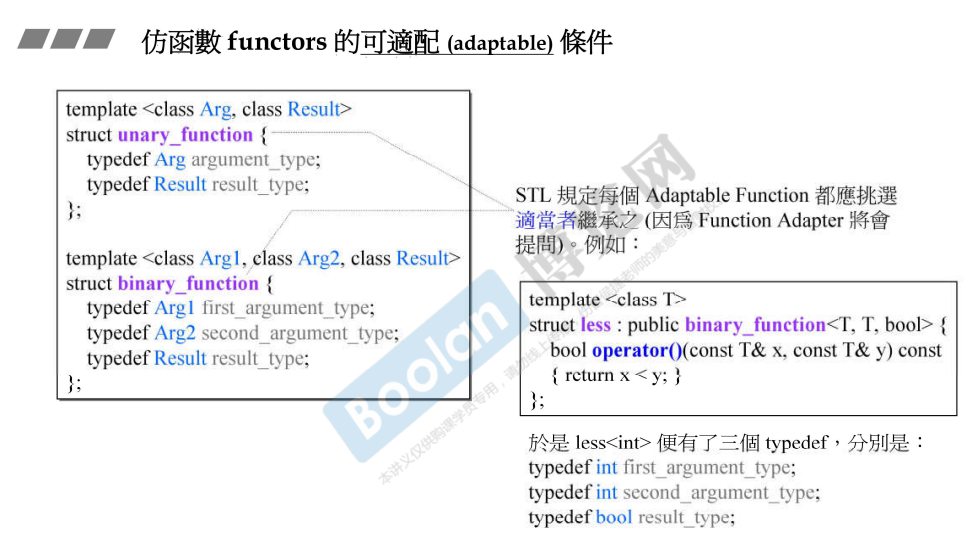

## 简介

到此为止，六大部件已经剩下 functor 和 adapter 两大部件，分配器、迭代器、容器、算法在之前都已经进行了介绍。

> <u>*在这里侯捷老师说明：functor 是最容易理解和编写的。*</u>

如上图，**functor 仿函数** 一般为算法服务，在上一讲 [24.算法源代码剖析（11个例子）](24.算法源代码剖析（11个例子）) 中列举的<u>***算法的 predicate 参数就为 functor。***</u>

functor 分为三类（上图）：**算术类**、**逻辑运算类**、**相对关系类**。

在上图中，各种仿函数继承自 **binary_function<>**，用于对两个传入的参数进行操作。这个模板类接收三个模板参数：**第一、第二个参数表示传入的<u>*第一、第二个参数的类型*</u>**；**第三个参数为<u>*返回值类型*</u>**。

又例如上图，**sort** 算法，左半部分调用了五次 sort。

> 1.使用对象的 **<** 比较。
>
> 2.使用 **myfunc**，这是一个函数。
>
> 3.使用 **myobj** 比较大小，这是一个 **myclass** 类型对象，这种类型重载了 **operator()，函数调用操作符**，让这种类型的对象像函数（c++ 面向对象高级开发.part2.4.像函数的类）。
>
> 4.**less<>**，也是一个类似 myclass 的类型，创建一个临时对象，提供给 sort 使用。
>
> 5.**greater<>**，与 less<> 相反，less<> 是比小，而 greate<> 是比大（<u>右半部分</u>），所以得到的序列为由大到小。

### 融入STL

> *<u>注意：在上述介绍的 **sort** 算法中自定义的仿函数 **myobj**，虽然说是可以运作，但由于没有符合 STL functor 相关的要求，再做某些操作时（适配）就会出错。</u>*

如上图，在上述的一些 functor 中，有一些继承自 **binary_function**，意为<u>*两个操作数的函数*</u>。另外，关于 **unary_function**，意为<u>*一个操作数的函数*</u>。

> <u>*在 STL 规定中，可适配的 functor 都应该挑选适当者（binary / unary）进行继承。*</u>（如上图右半部分）

这个规定的原因是：<u>***若想要对自定义的 functor 进行修改（适配）***</u>时，则需要进行上述的继承操作。这个就是下一讲的**适配器（adapter）**的内容。adapter 在进行修改时，可能需要访问这些别名（first_argument_type...）。<u>*就像算法需要像迭代器提问一样，适配器也需要向仿函数进行提问*</u>。

