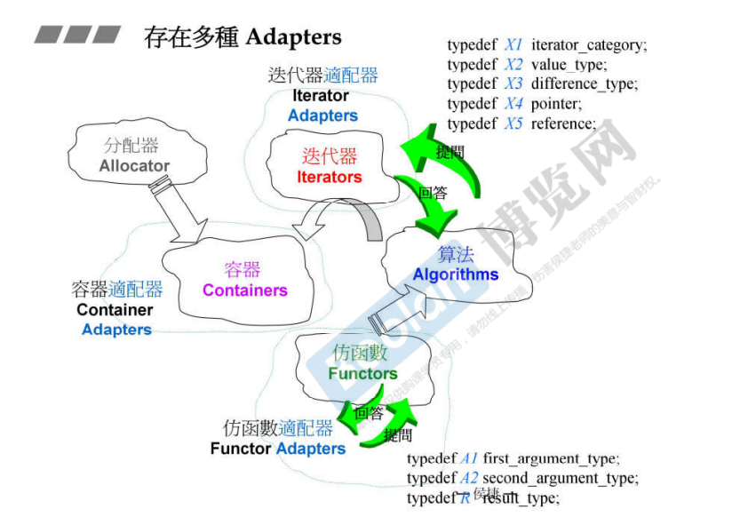
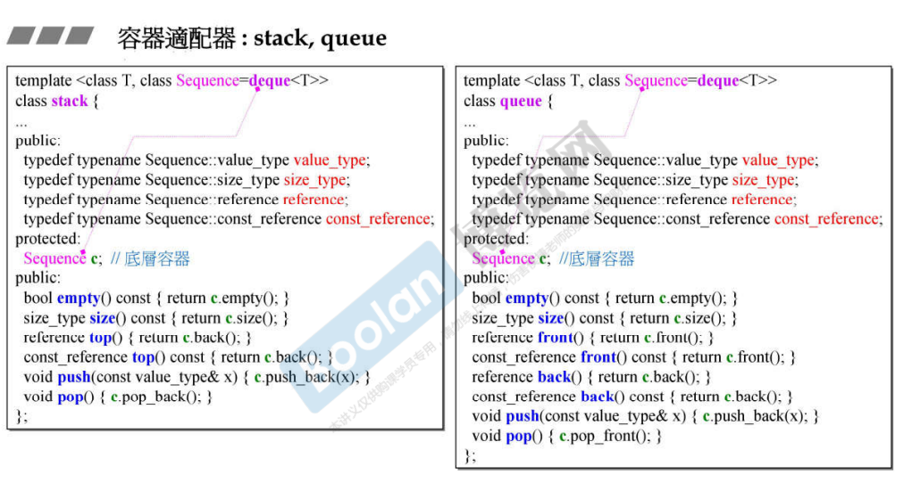

## 简介

现在即将进入 STL 六大部件的最后一个：**adapter**（适配器）

> <u>*可以将其理解为改造 / 修饰器，对某个类进行一些改造。*</u>

**adapter** 的改造在于：将一些类的功能的接口进行改造，例如原本两个参数，改造之后通过三个参数进行操作后调用该接口；又或者改变一个名称；等等等等。。。

<u>*说是改造，其实最终调用的还是被改造类的功能，只是在这之前进行了一些修饰。*</u>

如上图，可以看到 adapter 在 STL 有三种存在：functor、container、iterator 的 adapter。

<u>***对于一个类的改造 / 修饰而言，其实是通过 继承 / 组合的方式来实现***</u>。而在 STL 中的各种 adapter，其实是通过 **组合** 的方式来实现的。

在使用上，跟算法和迭代器的关系相似，[23.迭代器分类（category）对算法的影响](23.迭代器分类（category）对算法的影响) ，<u>*算法和迭代器提问，而 adapter 也会和被适配者提问*</u>（上图中的各种 typedef）。

上图展示了**容器的adapter**，[10.容器之间的实现关系与分类](10.容器之间的实现关系与分类) 中介绍了 stack、queue 基于 deque 实现（Sequence 默认为 deque）。

那么其实可以把 stack、queue 当作 deque 的 adapter，这里改造了 Sequence 的一些接口，底层还是得去调用 Sequence 的功能。