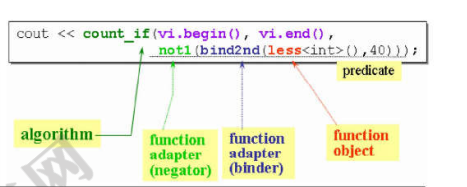
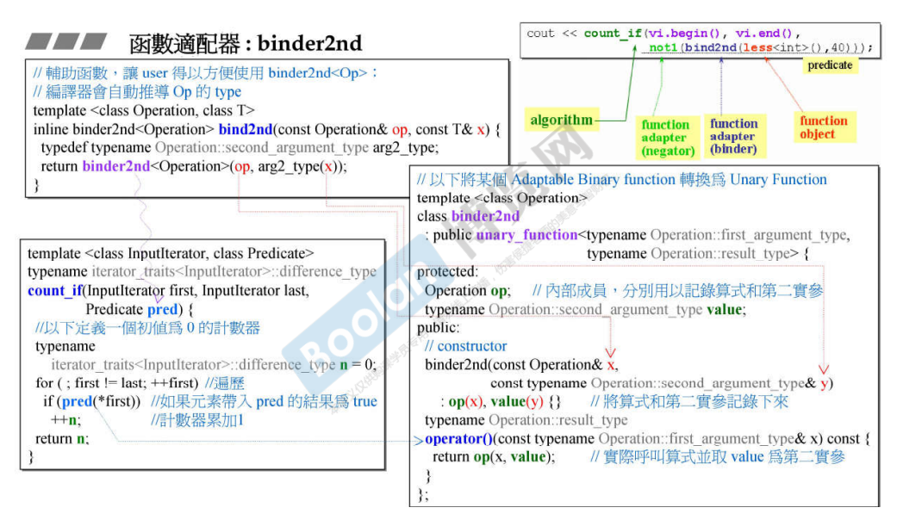
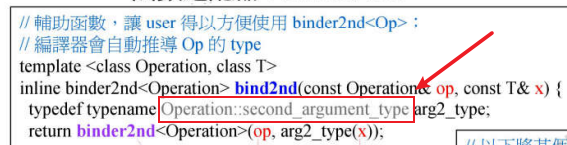
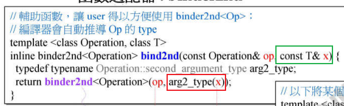
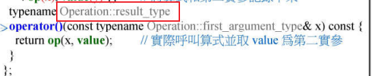
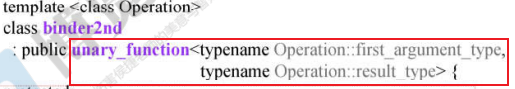
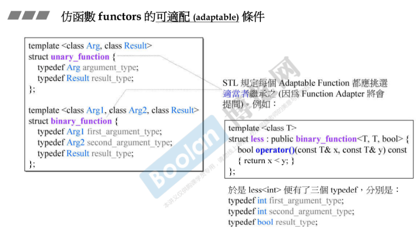

## 简介

在介绍完 queue 和 stack 是一种特殊的 deque，这样的设计是一种适配器设计（adapter）。在这里将去介绍很多函数适配器（function adapter）。



在第二讲 [2. STL体系结构基础介绍](2. STL体系结构基础介绍) 介绍 STL 时写了个样例（如上图）。

这里再重新介绍一下，需要去统计容器中不小于 40 的元素个数，核心代码如下：

```c++
bind2nd(less<int>(), 40);
```

在这里，**`less<>()`** 是一个比大小的函数，<u>**判断第一个元素是否小于第二个元素**</u>。而 **`bind2nd`** 是一个函数适配器，如它的名字，<u>**绑定传入函数的第二个参数**</u>。那么，上面的意思便成为了：小于 40 的元素。

## 具体实现



如上图，这是 `bind2nd` 的源码部分，由两部分组成：

> 1.在 <u>*左上角*</u> 为辅助函数，提供给调用方。
>
> 2.在 <u>*右边*</u> 则是具体实现。

现在看具体实现：

1. 成员构成

   ```C++
   protected:
   	Operation op;
   	typename Operation::second_argument_type value;
   ```

   可以看到，`bind2nd`的成员有两个：

   ​	第一个为模板参数类型 `Operation` 成员，具体是通过辅助函数传入，传入的是一个**仿函数对象（functor）**，按照上面的例子，传入的 `less<int>()` 是一个 `binary_function`，参考 [25.仿函数和函数对象](25.仿函数和函数对象)。

   ​	第二个成员为 `Operation` **（函数对象）的第二个参数（2nd）类型的值**，即 `Operation::second_argument_type`，也是由辅助函数传入。

2. `operator()`

   可以看到，`binder2nd` 本身就是一个仿函数（functor），即**<u>重载了调用操作符 `operator()`</u>** 的类，该操作符接受一个参数，这个参数的类型是 `Operation` 对象的第一个参数类型 `Operation::first_argument_type`

3. `count_if` 调用

   在调用 `bind2nd` 时，可以参考 `count_if` 方法（<u>*左下角*</u>）。

   该方法的<u>**第三个参数**</u>（谓语 Predicate）其实就是一个 functor。在这个例子中，当传入的谓语是一个 `bind2nd` 对象时，那么会去<u>**调用该对象的 `operator()` 方法**</u>，在该方法中<u>***将存下来的 `binary_function` 对象和第二个参数的值进行二次调用***</u>，即 `op(x, value)`，调用 `binary_function` 的 `operator()` 方法， 来做到绑定第二个参数的效果。

## 细节内容

> 以下内容是关于 `bind2nd` 和 `binder2nd`（真正的适配器）引申出来的内容，基本上 STL 的所有 adaptor 都有这些细节，以后将不再赘述。

### 辅助函数

可以看到，STL 很贴心的给使用者提供了模板函数 `bind2nd`，这样就可以让编译器去推到 `binder2nd` 的模板参数类型，而不需要使用者自己去编写。

### 类型问答



在 `bind2nd` 辅助函数中，第一个问题就是去询问 `Operation` 的第二个参数的类型是什么，即 `Operation::second_argument_type`。



然后去计较第二个问题（检测）：将传入的参数 `T` 去强制类型转换成 `second_argument_type`，来做到检测传入的参数是否符合 `operation` 的第二个参数的类型。



然后就是在 `binder2nd` 的 `operator()` 的返回值中也有一个检测，应该返回一个 `Operation::result_type` 类型的值。同样的，在传入时也会检查是否符合第一个参数的类型，即 `Operation::first_argument_type`。



另外，在使用时，`binder2nd` 本来就是一个 `unary_fnction`，这样做的话不仅更加符合适配器的特性，而且<u>**其本身可以被二次 adapt。**</u>

### adaptable 可适配

参考 [25.仿函数和函数对象](25.仿函数和函数对象) 中介绍到，可适配的条件需要去继承两个类型，`unary_function` 和 `binary_function`（如下图）。



这样才能使得 STL 的函数适配器在 <u>**类型问答**</u> 时得到答案。

## 结语

> 其他章节都没有结语，那为什么这张这么特殊，要有结语呢？

并不是笔者改变了风格😂，而是在 STL 中，`bind2nd` 或者说 `bind1st` 这些适配器其实已经过时了，有一种新型的适配器 `bind`，将会去代替这些 adaptor。

关于 `bind` 的内容，会另外起一个章节来详细介绍改内容🙂。