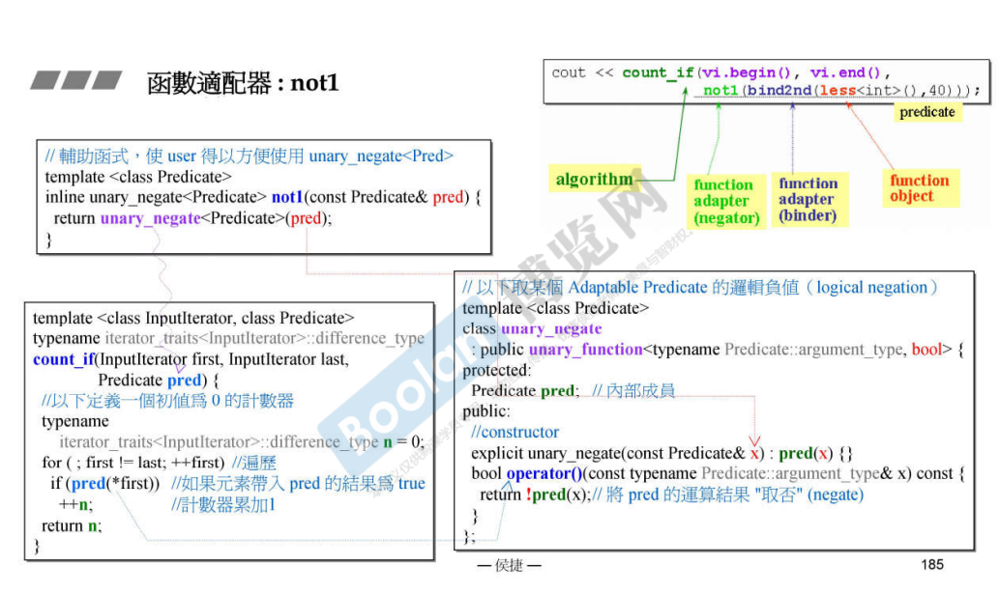

## 简介

在看完 `binder2nd` 之后，再来看 `not1`，就会简单很多。

这里就简单看看实现，如下图：

### 辅助函数

同样的，`not1` 也是一个辅助函数，真正实现的是 `unary_negate` 这个模板类，而这个模板类，是一个仿函数类型。

### 参数传递

在辅助函数 `not1` 中获取一个谓语（predicate），意为一个动作，一个操作。跟 `bind` 的 `operation` 是相同的，<u>**传入的是一个仿函数对象**</u>。

然后传入 `unary_negate` 的 `pred` 成员中。

### 调用

`unary_negate` 的 `operator()` 方法，则是将 `pred` 的运行结果取反。