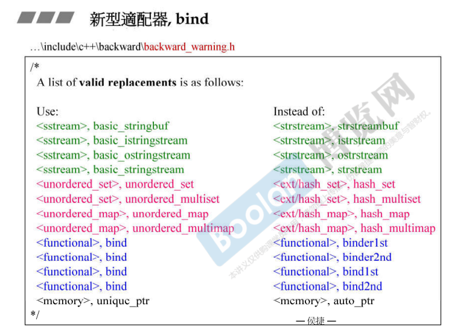
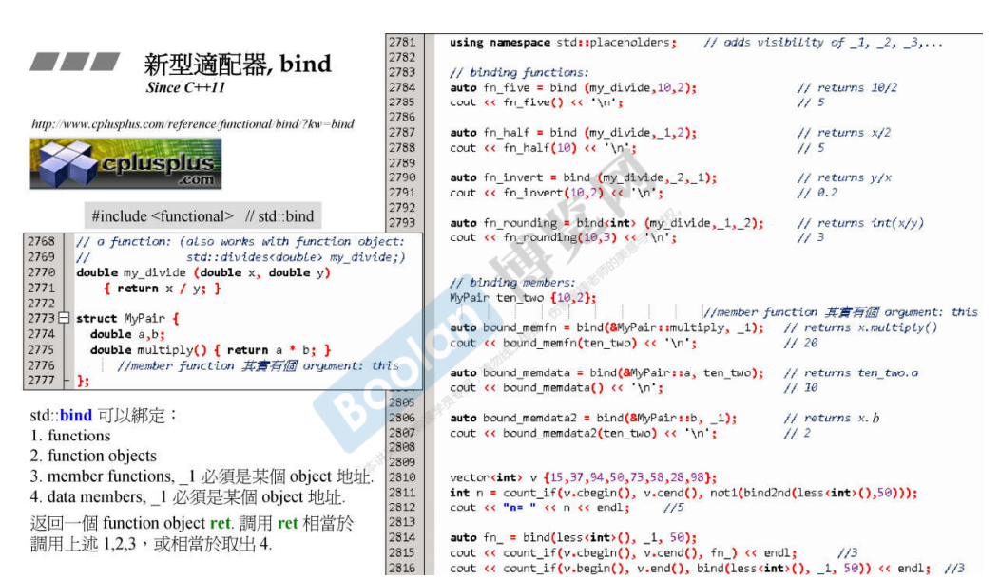
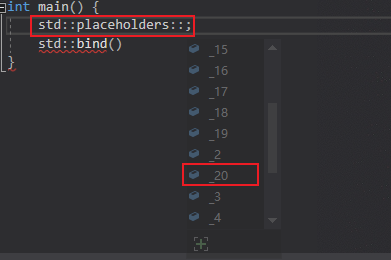

## 简介



如上图，这是一份替代关系表，表示为右边的类型将会被左边对应的类型进行替代。

在介绍完 [binder2nd](27.Binder2nd) 之后，其实有提到说 `bind` 将会去取代这些绑定方法。接下来就会详细介绍这个适配器。

## 使用

`std::bind` 是 c++11 提供的适配器。

> 在这里侯捷老师无论是在课件还是说在课堂上的内容，只介绍了如何使用 `std::bind`，而没有去介绍具体实现。
>
> 这里笔者认为这里涉及了 c++11 的一些新特性，例如说 可变参数模板、类型推导等等，这些内容新特性可能会在c++11-14 新特性系列课程中会被介绍，在这里介绍会延申太多内容。
>
> 先不管这么多，直接看如何使用吧😂~



如上图，在<u>*左下角*</u>部分介绍到，`std::bind` 可以绑定如下内容：

> 1.**函数**
>
> 2.**函数对象**，即仿函数
>
> 3.**成员函数**，这是 `binder2nd` 或者说 `binder1st` 中都没有的。
>
> 4.**类成员**，一个类中的成员也可以被绑定？！

关于第3、4点，现在会有很多疑惑，先来看例子：

### 定义

在上图左侧，定义了一个函数和一个类型。

```C++
double my_divide(double, double);

struct MyPair{
    double a, b;
    double multiply() { return  a * b; }
};
```

### 绑定

#### 占位符

```C++
auto fn_five = std::bind(my_divide, 10, 2);
cout << fn_five() << endl;	// 5
```

在上述代码中，使用 `bind` 绑定一个函数，这个函数是我们提前定义的除法函数 `my_divide`，会返回一个函数类型的对象 `fn_five`，调用时使用调用操作符即可，即 `fn_five()`。

然而这并不是我们想要使用的，真正的使用方式如下：

```C++
auto fn_half = std::bind(my_divide, std::placeholders::_1, 2);
cout << fn_half(10) << endl;	//5
```

可以看到，这里的 `bind` 将第二参数绑定为 2，而第一参数是一个<u>***占位符***</u>，`std::placeholders::_1`，这个占位符的意思为：<u>***在调用时，将第一个参数放置在占位符 `std::placeholders::_1` 的位置。***</u>



另外，关于占位符，在 VC 中有 `_20` 之多，如上图。

```C++
auto fn_invert = std::bind(my_divide, std::placeholders::_2, std::placeholders::_1);
cout << fn_invert(10, 2) << endl;	//0.2
```

更多关于占位符的用法，如上述代码，可以看到输出的结果为 `0.2`，这是因为在绑定时，<u>***将调用时的第二个参数作为第一个参数进行传入，第一个参数作为第二个参数传入***</u>。

> 注意，这里笔者一直强调的是 <u>**调用时**</u>，和绑定时的参数次序不同，占位符决定的是调用后的参数传递次序。

> 在这里侯捷老师并没有追究 `placeholders` 和 `bind` 如何结合，这里也不再深究，后续有机会笔者再进行补充吧（挖坑）

#### 返回值

```c++
auto fn_rounding = std::bind<int>(my_divide, std::placeholders::_1, std::placeholders::_2);
cout << fn_rounding(10, 3) << endl;	//3
```

在上述代码中，制定了 `bind` 的返回值（`std::bind<int>`），若函数返回值和指定的返回值能够进行类型转换，也是可以通过编译。

#### 成员函数

```C++
MyPair ten_tow {10, 2};

//std::placeholders::_1 必须是个 object 的地址
auto bound_memfn = std::bind(&MyPair::multiply, std::placeholders::_1);
cout << bound_memfn(ten_tow) << endl;	//20
```

参考 <u>C++面向对象高级开发.Part1.5.操作符重载与临时对象</u>，这里介绍了在类成员函数中，编译器会<u>***隐式的将成员函数第一个参数传入 this 指针***</u>，成员函数通过 `this` 指针获取成员。

所以这里的 `bind` 很符合这个理念，将 object 本身作为 this 指针传入，用于在调用成员函数时，通过 this 指针来获取数据成员。

或者这样理解也可以，通过 object 调用其成员函数时：`ten_tow.MyPair::multiply()`。将前面的对象传入，才能够正确的调用成员函数。

> 两种理解方式这里笔者跟倾向于第一种，不知道各位读者怎么理解？😓

#### 成员对象

```C++
auto bound_memfn = std::bind(&MyPair::a, ten_tow);
cout << bound_memfn() << endl;	//10
```

上面的代码中没有使用占位符，而是直接绑定的对象，那么在调用时就没有必要去绑定对象了。和绑定成员函数类似。

但是需要注意的是：<u>**成员必须可访问，否则不能直接绑定**</u>。