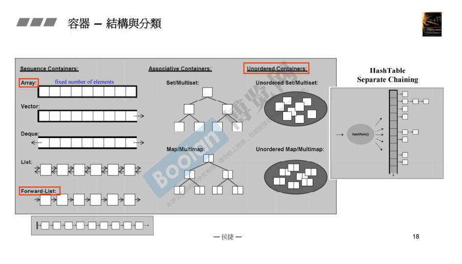

## 简介

所以可能会比较长，毕竟涵盖的内容较多。

了解容器的分类非常重要，针对不同的使用场景，选择不同的容器，可以提升程序的运行效率。

## 容器的分类

如上图，容器类型大致分为以下三种（两种）。

### 顺序容器（Sequence Containers）

> 元素顺序存储的容器。

#### Array

跟 **c++ 本身的数组相同**，<u>*给定一个大小，是一块连续的空间*</u>，只不过包装成了一个类 array。

跟图中一样，<u>***array 无法扩充***</u>。

#### Vector

跟 array，同样<u>*是一个顺序容器，一块连续的空间*</u>。

与 array 不同的是：<u>*起点无法扩充，但是在结尾可以*</u>。当扩充时会自动扩充 vector 的大小。

#### Deque

**双向队列**（<u>*queue为队列，Deque就为双向队列*</u>），<u>*两端可进可出*</u>。

#### List

**双向环状链表**，<u>*每个元素使用指针连联系*</u>，显而易见内存不连续。

#### Forward-List

**单向环状链表**，跟 List 相同，不过是单向的。

### **关联容器（Associative Containers）**

> 使用 key-value 来将数据进行关联。
>
> 当使用 key 来查找元素时，会非常的快。

#### Set & Map

**底层实现是一个二叉树（红黑树，高度平衡二叉树）。**

如上图：

> Map 的每个节点由 key-value，查找时通过 key 查找 value。
>
> Set 则没有key。

**注意：当 <u>*Set / Map*</u> <u>*不为 Multi*</u> 时，则对应的 <u>*元素 / key*</u> 只能唯一。**

### **无序容器（Unordered Containers）**

> 出现于 c++11 中，**也是一种关联容器**，是一种不定序的容器，元素放入容器中没有一定的次序。
>
> 在通过一些操作后，元素的顺序可能会改变。

#### Unordered Set / Map

**底层实现为 hash table （哈希表）**

> 哈希表：<u>*有一些 bucket （数组），每个 bucket 是一个链表，链表上指向的容器中的每个元素*</u>。
>
> 例如：现在有一些元素，通过某个方法（哈希函数）计算该元素需要放置到哪个 bucket 中，然后放置进入每个 bucket 的链表中。