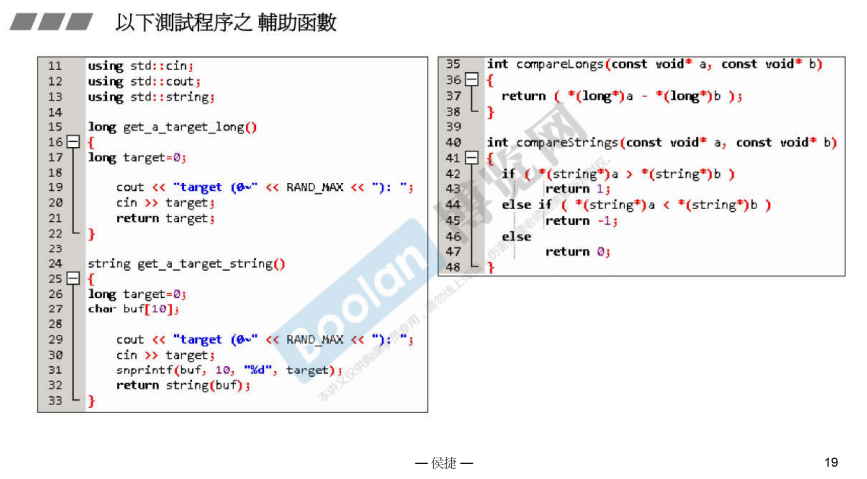
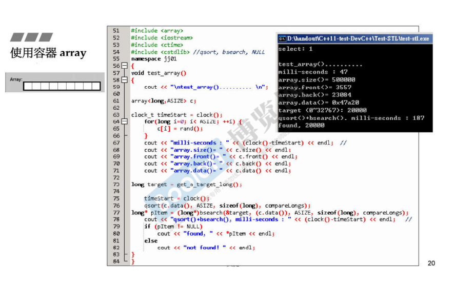
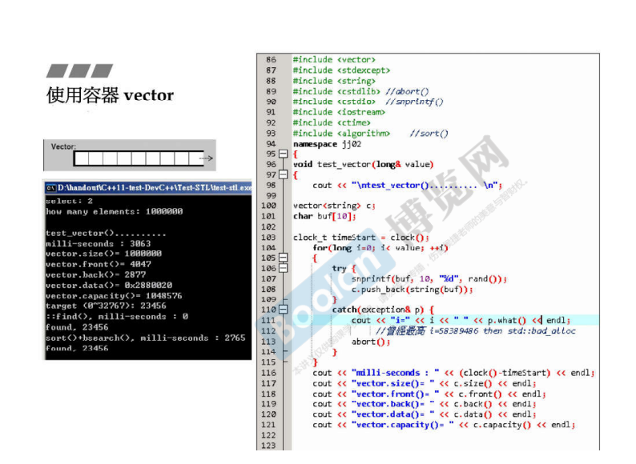
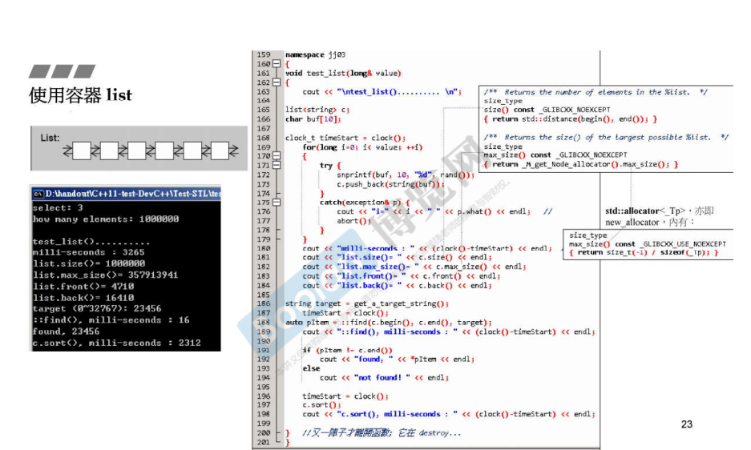
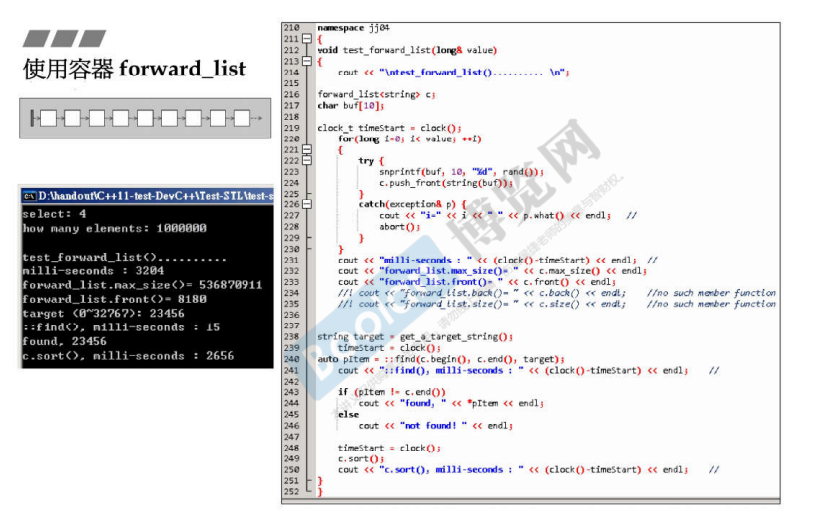
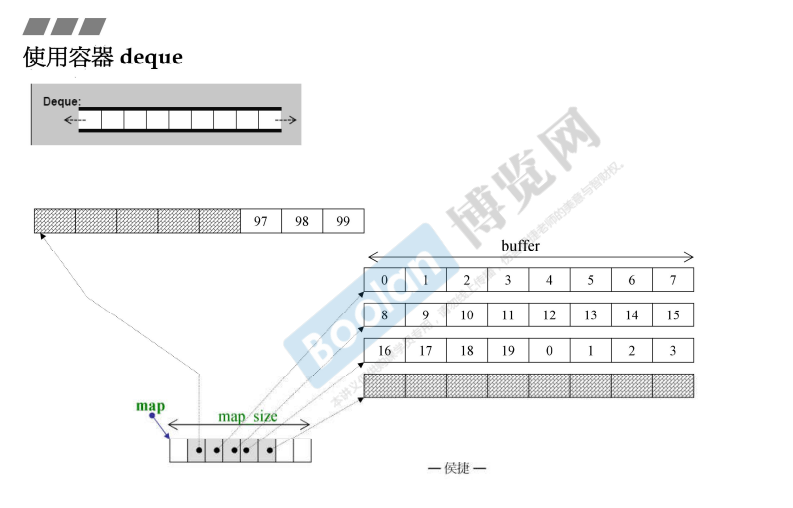
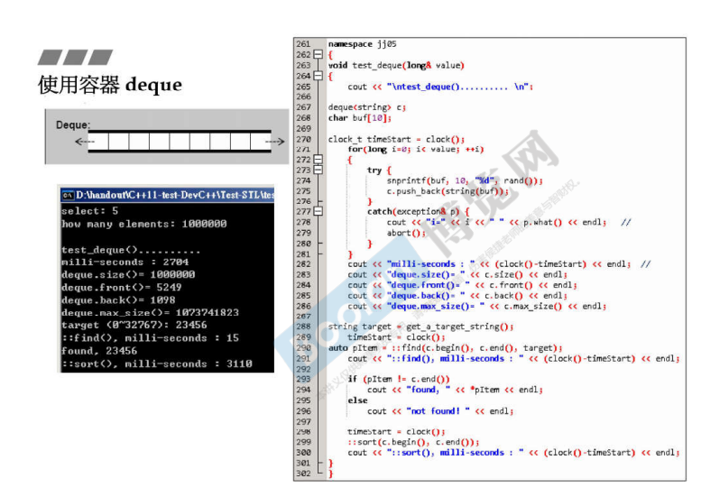
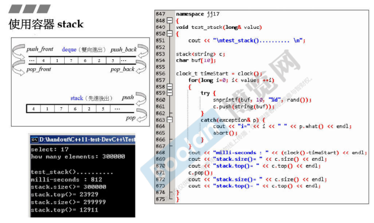
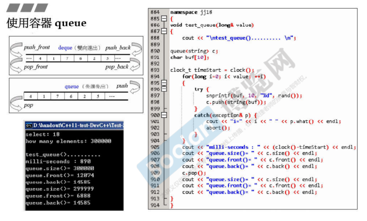

## 简介

在介绍完容器的分类后，我们需要了解一下容器的基本使用。

在本篇笔记中会<u>*介绍到容器的基本使用方式*</u>，并且<u>*展示不同的容器在使用时各个方面的效率。*</u> 

基本上都是以插入大量的元素（一百万、五十万）所花费的时间，以及从中找出对应元素的时间（可能会有不同方法）来测试容器的各项性能指标。

在使用时，会用到下图中的辅助函数：



整个测试的过程是通过：元素的放置、查找、一些操作，以及这些内容所花费的时间来展示容器在各个不同的内容中花费了多少时间。

> <u>***引用的头文件一般为容器名***</u>

## array

```C++
#include<array>
```



如上图，关于 array 的测试：

​	#include<array>

> 1.首先声明一个长为 500000 的类型为 long 的数组，并且放置随机数进入数组中。

> 2.调用基本的方法，查看 array 的基本属性
>
> ​	**size()** ：查看<u>*数组大小*</u>
>
> ​	**front() ，back()** ：查看数组中<u>*第一个和最后一个元素*</u>
>
> ​	**data()** ：返回数组<u>*在内存中的起点*</u>

​	#include <cstdlib>

> 3.对数组 **进行排序**
>
> ​	使用**标准库（c）**的 <u>***qsort()***</u> （快速排序）来对数组进行排序，需要的参数依次为：
>
> ​	①容器在内存中的起点
>
> ​	②容器的大小
>
> ​	③容器元素类型大小
>
> ​	④排序的比较方法（大于返回 1，等于返回 0，小于返回 -1），<u>***这样会使得容器中元素从小到大排序***</u>

> 4.对数组进行 **二分查找**
>
> ​	使用**标准库（c）**的 <u>***bsearch()***</u>（二分查找）来找出对应元素，对应参数除了多一个查找目标 target 外，跟 qsort() 没有区别。
>
> ​	**注意：二分查找前需要对元素进行排序**

## vector

```C++
#include<vector>
```



如上图，关于 vector 的测试：

> 1.对 vector 插入 1000000 个元素，使用 **push_back()** 方法，从尾巴放入新的元素。
>
> **注意：vector 在不断放入元素时，当空间不足够在放置时，容器的长度会两倍增长。** <u>*例如，当 push_back() 一个元素之后，在添加一个元素时，发现空间不够，就把原来的空间扩大两倍，下次继续扩大两倍。*</u>

> 2.观察 vector 的<u>*各种属性*</u>
>
> ​	**size()** ：为 <u>*vector 真正的元素个数*</u>
>
> ​	**capacity()** ：容量，<u>*为 vector 所占用的空间有多大*</u>

（续上图）


> 3.从容器中查找元素，使用 **STL** 的函数进行查找
>
> ​	调用 **algorithm（STL）** 中的 <u>***find()***</u> 函数，该函数接收以下三个参数（<u>*表示容器的范围，以及查找的目标*</u>）：
>
> ​	①容器的开头
>
> ​	②容器的结尾
>
> ​	③查找的目标
>
> ​	返回值一个**迭代器**。

> 4.从容器中查找元素，使用 **c 标准库**的函数（<u>*bsearch*</u>）进行查找
>
> ​	与 array 的测试例子一样，必须先进行排序，才能使用二分查找。
>
> ​	调用 <u>***sort()***</u> 进行排序，该函数为 STL 的函数，在头文件 algorithm 中。
>
> ​	使用 <u>***bsearch()***</u> 查找元素。
>
> ​	**可以看到速度不如直接 <u>*find()*</u>，因为要先排序，在进行查找，效率可能跟不上直接查找。**

## list

```C++
#include<list>
```



如上图，关于 list （双向链表）的测试：

> 1.同样的，对 list 插入 1000000 个元素，使用 **push_back()** 方法
>
> ​	跟 vector 不同的是，**vector 是连续的内存**，<u>*在不断添加元素的过程中长度会成长，而成长就是意味着**重新分配内存，再拷贝所有元素，过程缓慢***</u>。
>
> ​	而 list 则是放置元素时，<u>*通过**指针来访问元素所在的内存**，不需要重新分配*</u>。

> 2.观察 list 的各项属性：
>
> ​	**size()** ：list 的大小（<u>*元素数量*</u>）
>
> ​	**max_size()** ：list 的<u>*最大容量*</u>（<u>理应是电脑的最大内存，但是侯捷老师却解释说不是，需要后续介绍具体实现。</u>）
>
> ​	**front()** ：第一个元素
>
> ​	**back()** ：最后一个元素

> 3.查找元素：
>
> ​	使用 <u>*algorithm 库*</u>的 **find()** 进行查找，该查找的方法为<u>***循序查找***</u>

> 4.排序：
>
> ​	使用 <u>*list 容器自带*</u>的 **sort()** 进行排序。（这里<u>*并没有调用 c 标准库里面 qsort()*</u>)
>
> **<u>注意：在容器中有对应的方法，在标准库全局中也有时（例如 排序），则需要*优先考虑使用容器中自带的算法*。</u>**

## forward_list

```C++
#include<forward_list>
```



如上图，关于 forward_list （单向链表）的测试：

> 1.向 forward_list 中插入 1000000 个元素，使用的是 **push_front()** 方法。
>
> **注意：是 <u>front</u> 不是 <u>back</u>**

> 2.观察 forward_list 的属性：
>
> ​	**max_size()** ：最大容量。
>
> ​	**front()** ：第一个元素
>
> **<u>注意：*size()* 和 *back()* *不在 forward_list 中*。</u>**

> 3.查找元素：
>
> ​	使用 <u>*algorithm 库*</u>的 **find()** 进行查找，该查找的方法为<u>***循序查找***</u>

> 4.排序：
>
> ​	同样的，类似双向链表 list，该容器也有自己的 **sort()** 排序方法

## deque

```c++
#include<deque>
```

### 结构



deque（双向队列），如上图，是一个双向可进可出的容器。

可以看到 deque 的底层结构：

​	<u>*由很多的 buffer 组成，通过一个 map 集合在一起*</u>，通过指针来指向每个buffer，看起来有次序，但实际上 deque 在内存中是 **分段连续** 的。

​	当 buffer 占满时，若继续添加元素，则会通过所有 buffer 的 两端<u>*分配**新的 buffer** 来做到两端扩充*</u>。（push_back()向后扩充，push_front() 向前扩充）

### 测试



如上图，关于 deque（双向队列）的测试：

> 1.使用 **push_back()** 放入元素。

> 2.查看 deque 的一些属性：
>
> ​	**size()** ：元素个数
>
> ​	**front()** / **back()** ：第一 / 最后一个元素
>
> ​	**max_size()** ：最大容量

> 3.查找元素：
>
> ​	使用 <u>*algorithm 库*</u>的 **find()** 进行查找，该查找的方法为<u>***循序查找***</u>

> 4.排序：
>
> ​	使用 <u>*algorithm 库*</u>的 **sort()** 进行排序，<u>*双向队列自身并不拥有排序算法*</u>

## stack

```C++
#include<stack>
```



如上图，容器 stack （栈），他的实现是基于 deque。

但是跟 deque 两端进出不同的是，他的元素的进出是 **先进后出**

> 1.<u>*放置元素*</u>，使用 **push()** （没有 front 和 back）
>
> <u>*取出元素*</u>，则使用 **pop()**

> 2.查看属性：
>
> ​	**size()** ：元素个数
>
> ​	**top()** ：查看栈顶元素，这个元素是<u>*最后一个 push 的元素*</u>（也就是 pop() 的元素）

## queue

```C++
#include<queue>
```



如上图，容器 queue （队列），他的实现也是基于 deque。

但是跟 deque 两端进出不同的是，他的元素的进出是 **先进先出**

> 1.和 stack 相同
>
> ​	放置元素使用 **push()**，取出元素使用 **pop()**

> 2.查看属性
>
> ​	**front()** ：和 stack 相反，是<u>*第一个 push 的元素*</u>

## 一些总结

以上介绍了 **顺序容器** 中在内存结构上的使用，例如<u>*容器如何添加元素，以及容器自身如何增长*</u>。后续需要更加系统的学习，才能更好的判断。

那么同时，关于顺序容器，无论是那种，<u>*在查找元素时，总是会花费掉一些时间*</u>，例如二分查找前需要排序；顺序查找则需要依赖于容器元素数量等。

> <u>*另外，关于 stack 和 queue，并没有自己的实现，而是基于 deque。所以被称为容器的 adapter，当然叫做容器也没关系。*</u>
>
> 例如：不提供 **迭代器（iterator）**，不能够随意改变元素。

下面介绍的**关联容器**，拥有<u>*查找元素非常快*</u>的特性，常常瞬间完成查找。

