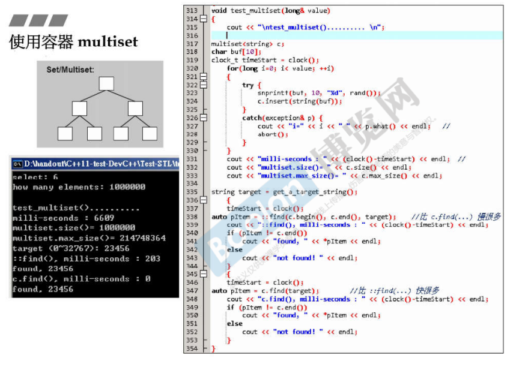
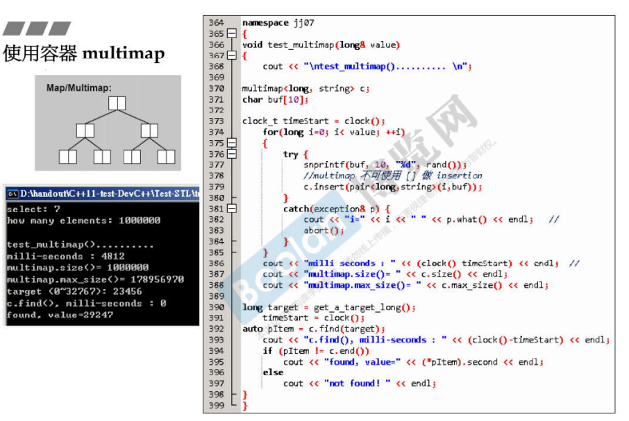
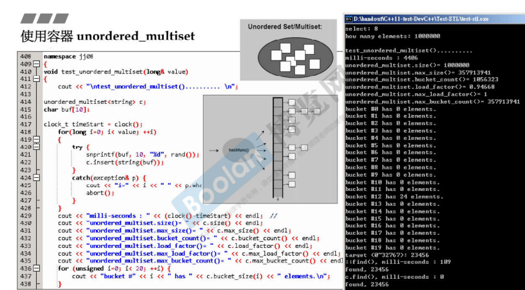
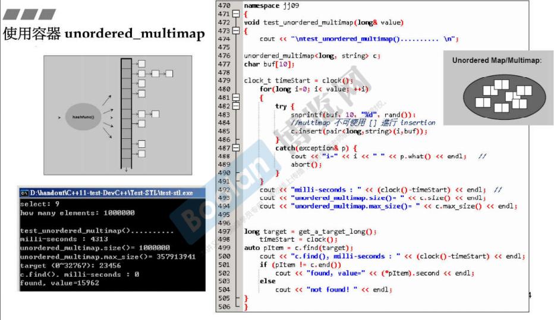
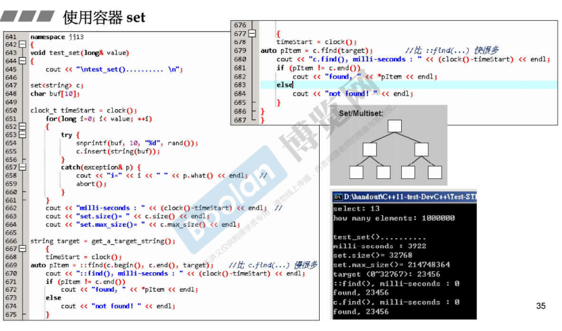
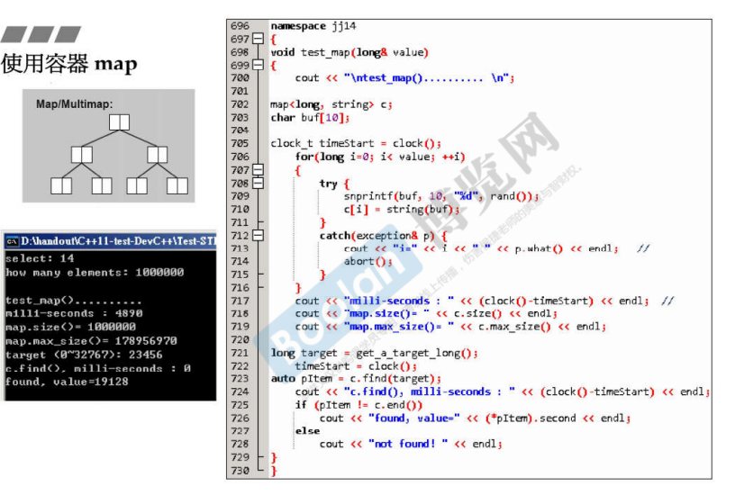
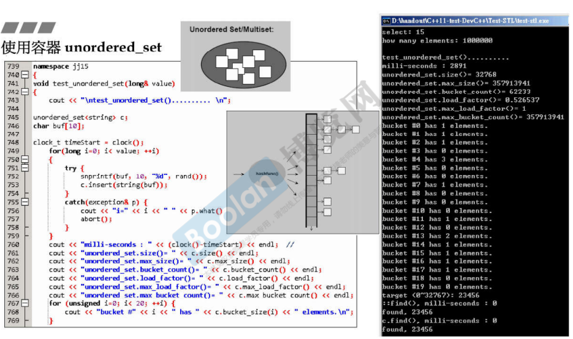
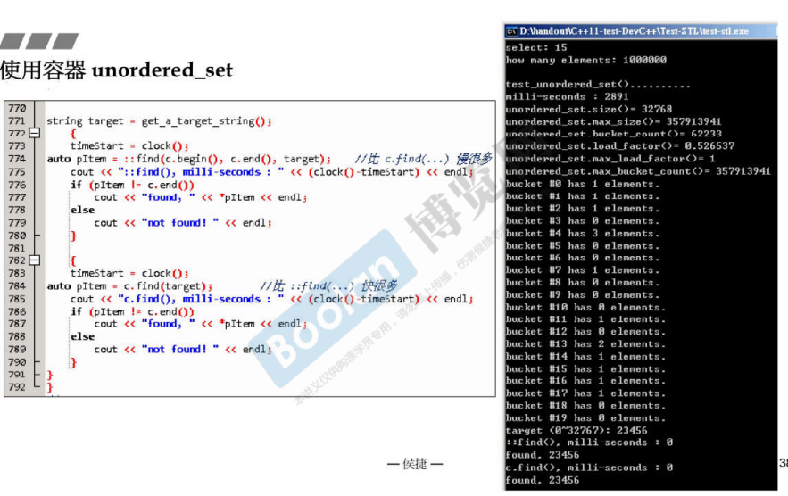
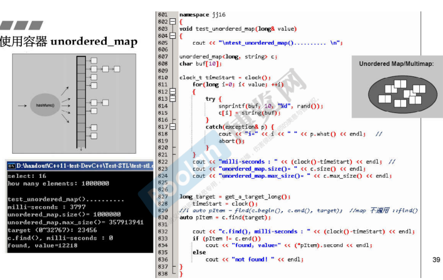

## 简介

当我们的着重点在查找元素，安插元素的速度可以慢一些，但是查找必须快时，可以去选择使用关联容器。

关联容器分为八种，通过组合：

> 1. **map** / **set**
> 2. **multi** 元素是否重复
> 3. **unordered** 容器是否有序（实现基于红黑树还是哈希表）

​	可以组合出八种关联容器。

头文件的组合：

> 1.**map** / **set**
>
> ​	囊括了有序的容器，并且包含了是否 multi（四种）
>
> 2.**unordered_map** / **unordered_set**
>
> ​	囊括了无序的容器，并且包含了是否 multi（四种）

​	总共八种。

## multiset

```C++
#include<set>
```



如上图，首先介绍 multiset。侯捷老师简单解释道：由于测试需要，插入 1000000 个元素，不重复的概率很低，所以先去介绍multiset（可以放置重复元素）。

<u>***multiset 是基于红黑树实现的。***</u> 在 [3.容器的分类](3.容器的分类) 中的有介绍 <u>*关联容器标签下*</u>有介绍

> 1.放置元素
>
> ​	使用方法 **insert()**，将元素安插到容器中。
>
> ​	不像顺序容器，元素的放置并不是安插在 头 / 尾，可以看到花了还不少时间（6609毫秒），<u>***这种开销主要是在将数据安插在树状结构上。***</u>

> 2.查看属性
>
> ​	**size()** ：元素个数
>
> ​	**max_size()** ：最大容量

> 3.查找元素
>
> ​	通过 algorithm STL库中的 find()，**std::find()**。
>
> ​	通过 multiset 容器自身的 find() 成员函数，**multiset.find()**。
>
> 可以看到容器自带的 find() 更加快，在 [4.容器相关测试(顺序容器)](4.容器相关测试(顺序容器)) 的 list / forward_list 标签下有初步解释，<u>*在容器自身有相对应的成员方法时，尽量去使用该方法代替去使用全局的方法*</u>。
>
> 并且可以看到，<u>*无论通过哪个方法去查找*</u>，查找的结果均为**容器的迭代器**。

## multimap

```C++
#include<map>
```



如上图，multimap，<u>*它的每个元素是由 key-value 组成*</u>。<u>*查找元素时，通过 key 进行查找。*</u>

如上图 370 行：

```C++
multimap<long, string> c;
```

来声明一个map，前面为 key, 后面为 value。

> 1.放置元素
>
> ​	使用 **insert()** 方法插入元素。
>
> ​	可以看到接收的参数是一个 **pair**，<u>*第一个元素为 key，第二个为 value。*</u>
>
> **注意：multimap 不能使用 [] 下标操作符来添加元素，后续介绍 map 时将会介绍**
>
> 另外，下标**操作符的重载** 在 <u>*c++面向对象高级 part2.2.转换函数*</u> 中的 <u>*延申*</u> 标签下有示例代码。

> 2.查看属性
>
> ​	跟 multiset 一致。

> 3.查找元素
>
> ​	同样的，类似 multiset，使用 <u>*multimap 容器的成员函数*</u> **find()** 来检索元素。
>
> ​	可以看到，得出的结果是一个迭代器，通过解引用得到容器中的元素，是一个 pair 类型。

## unordered_multiset

```C++
#include<unordered_set>
```



如上图，unordered_multiset，在 [3.容器的分类](3.容器的分类) 的 <u>*无序容器*</u> 标签下介绍到，<u>*这种类型的容器底层通过**哈希表（hash table）**实现。*</u>

>  1.放置元素
>
> ​	**insert()**

> 2.查看属性
>
> ​	size() ：元素数量
>
> ​	max_size() ：最大容量
>
> ​	**bucket_count()** ：<u>*篮子的数量*</u>，可以看到篮子的数量比元素个数要多，这是合理的，<u>*在哈希表的示例图中，有些 bucket 有元素，而有些 bucket 可能有多个元素*</u>。
>
> ​		**bucket 数量一定比元素多**：这是为了<u>*提升查找元素的速度*</u>，查找 bucket 很快，但是如果 bucket 中的元素太多，则会太慢。
>
> ​		如果 **元素的个数 >= bucket的个数**，**bucket 将扩充为原来的两倍。**
>
> ​	**bucket_size(int)** ：查看<u>*某个 bucket 中的元素数量*</u>。
>
> ​	**load_factor()** ：载重因子，这里不深入，最大为 1（上图）。


> 3.查找元素
>
> ​	同样使用两种方法，可以看到<u>***使用成员方法确实比标准库要快。***</u>

## unordered_multimap

```C++
#include<unordered_map>
```



> 1.放置元素
>
> ​	与 map 类型相同，**insert()** 方法传入一个 **pair**

> 2.查看属性
>
> ​	不列举了，都相同。

> 3.查找元素
>
> ​	同样的操作，不再列举。

## set

```C++
#include<set>
```



如上图，set，不带 multi，意味着元素不能重（key 是唯一）。

> 1.放置元素
>
> ​	**insert()**

> 2.查看属性
>
> ​	**size()** ：根据上述例子，放置 1000000 个元素，每个为随机数，不重复的概率很低，所以元素的个数比放置的次数要少。
>
> 其他都大致相同。

其他的都大致相同，不赘述了😓。

## map

```c++
#include<map>
```



如上图，map，key不能够重复。

**当放置的 key 重复时，则会拒绝放置，不会被放进去。**

> 1.放置元素
>
> ​	除了使用 **insert()** 之外，可以通过 [] 下标操作符放置元素，<u>*这个操作会将 key-value 合成一个 pair，放入容器中*</u>。

其他的大致相同😓，不再赘述了~。

## unordered_set

```c++
#include<unordered_set>
```

跟 unordered_multiset 相同，只是元素不能重复。





## unordered_map

```c++
#include<unordered_map>
```

跟 unordered_multimap 相同，只是元素不能重复。



