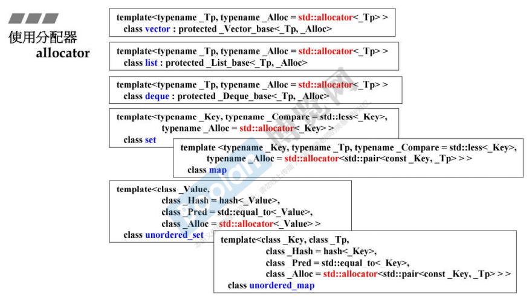

## 简介

容器的背后需要**分配器**来<u>*支持他对内存的使用*</u>。

在理想情况下，在使用时我们不需要去了解，使用默认的分配器已经足够好了。



如上图，在标准库（STL）中，每个容器中都会带一个分配器。 **std::allocator**

## 使用分配器


在上图中，<u>*这里只看右边部分*</u>，左边部分是侯捷老师使用 gnu_c 中的分配器的例子，这里不需要过多了解。

> 其实侯捷老师解释道：<u>***没有必要去用分配器去分配一节内存出来，我们真正使用的是容器，而并非分配器。***</u>

在这里，只看右边部分的第一个分配器，也就是 STL 中的分配器：

```C++
int* p;
allocator<int> alloc1;
p = alloc1.allocate(1);	//分配一个元素
alloc1.deallocate(p, 1);	//释放分配的内存
```

可以看到，完全没必要用分配器来分配内存，<u>*若想要直接分配，可以使用 new / delete 搭配来管理分配和释放内存*</u>。

否则在**释放时**还<u>*需要传入分配内存的大小（元素数量）*</u>。

> 所以，不应该直接使用分配器，这样会增加负担。
>
> 应该使用容器，如果使用少量的内存分配，可以使用 new / delete 或者 malloc / free

