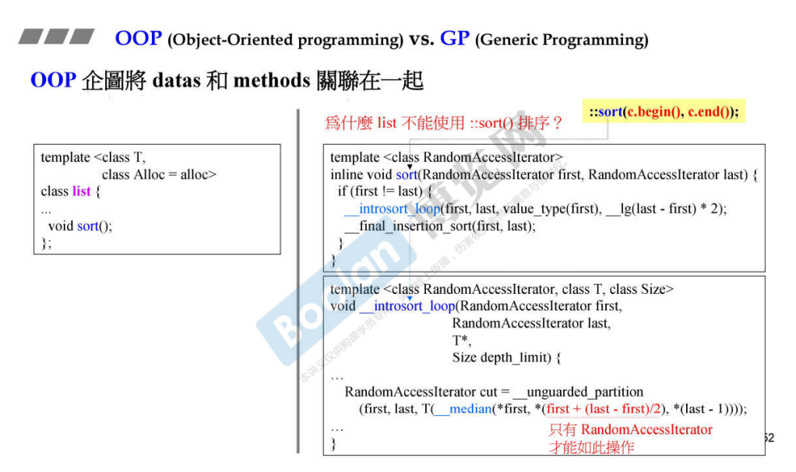
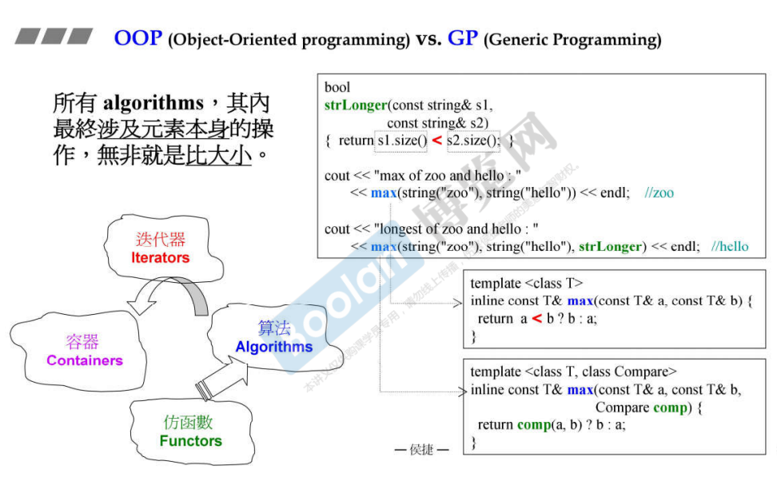

## 简介

整个标准库（STL）并不是使用面向对象的思想（OOP）来进行设计的。并没有太多的类继承、虚函数等手法。

取而代之，其设计手法使用了大量的泛型编程 Generic Programming（GP） [1.导言](1.导言) 。

### 容器内置 与 全局algorithm标准库

如上图，左半部分的 list，**数据和操作关联在一起**，这就是<u>*面向对象（OOP）*</u>。

从<u>*上图右侧*</u>这里可以看出 sort() 的实现，通过 **RandomAccessIterator**（随机访问迭代器）来访问容器的元素。<u>**list** 在内存中的结构是离散的，并且**不能通过上图中这个迭代器运算来获取元素**</u>，所以在 [4.容器相关测试(顺序容器)](4.容器相关测试(顺序容器)) 中的 <u>*list标签下*</u>，没有使用标准库的 sort() 方法来进行排序，而是使用了list对象的方法。

> 并不是所有的都像 list 这样，成员中有就不能使用标准库中的方法。
>
> 例如关联容器 map 和 set，他们内置都有 find，但也可以使用标准库的 find，只是速度比标准库快。

### STL中的操作符重载

而 <u>*泛型编程 GP*</u> 则是数据将 **数据和操作分开来**，如下图。

可以看到，在上图中 <u>*vector 和 queue 都没有排序（sort()）方法*</u>，想让其进行排序，<u>*需要使用 algorithm 库的 sort() 方法*</u>，来让容器中的元素进行排序。

sort() 方法是通过容器的迭代器 iterator 得到容器的范围，然后对该范围进行排序。

**这种就是数据和操作分开。**

这样做的好处是能让两个团队各做各的（containers 和 algorithm），通过迭代器 iterator 进行串联使用，<u>*如上图左半部分*</u>。

如上图右半，在 algorithm 库中的 min / max 函数，功能是比较传入参数的大小。当使用者需要去使用这些方法时，需要去实现对应的操作符重载 operator < / operator > （<u>*C++面向对象高级开发 part1.5.操作符重载与临时对象*</u>），才能够去使用这些方法。

同样的，<u>*algorithm 通过 iterator 获取 container 的元素*</u>，有时候也会去调用这些方法，**所以若想让容器能够被操作，需要先对其元素做对应的操作符重载。**

> <u>*在标准库中，操作符重载扮演非常重要的角色。*</u>

### STL中的仿函数

如上图，<u>*除了接收两个对象参数外，还可以接收一个参数（Compare）。*</u>这个参数是一个动作，代替原来的操作符重载的动作。

同样是比较两个对象的大小（string），在不接收动作的时候（第三个参数），会调用类的 operator < 操作（string 默认通过每个字符的 ASCII 码来比较大小）；除此之外，通过定义一个 compare 方法，让 string 对象通过对比长度来比较大小。

