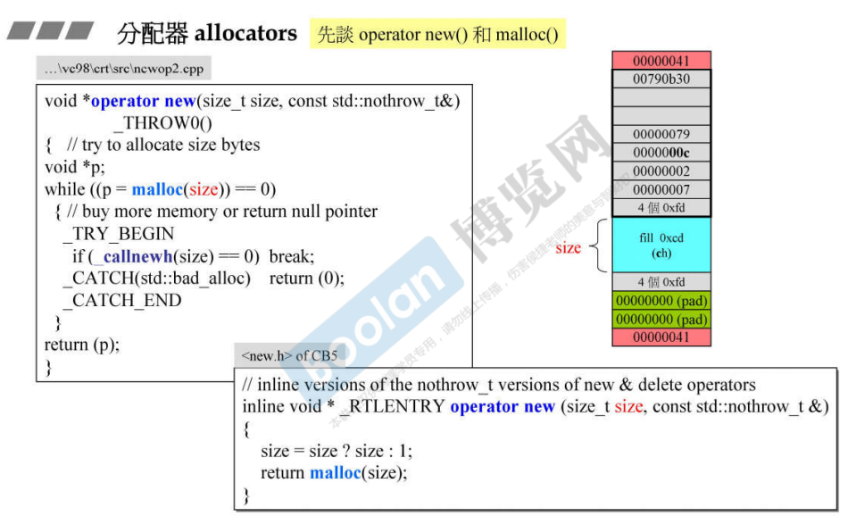
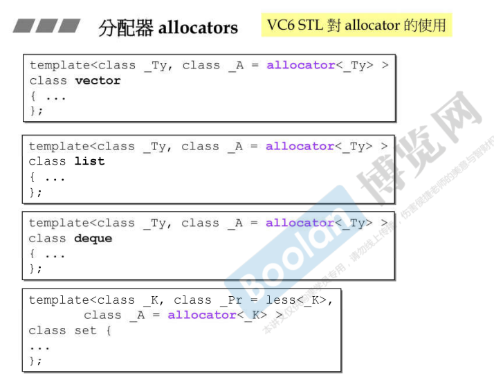
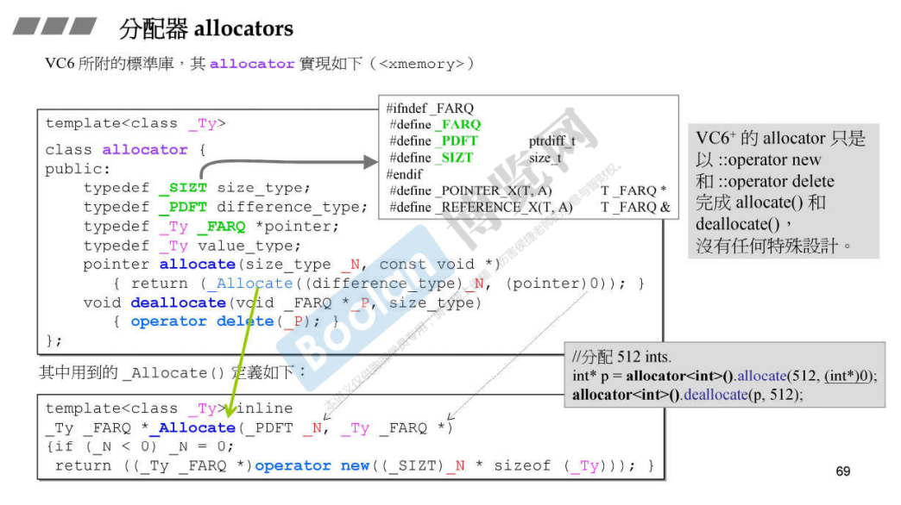

## 简介

是专属于容器的一种工具，一般不用做直接使用。

## operator new() 与 malloc()

所有的分配动作，最终都会归结于 malloc()，这个函数再根据不同的平台（windows、Linux等）调用操作系统的 api，最终得到分配的内存。

（C++面向对象高级开发.part2.14.new & delete）中介绍了 operator new

在 c++ 层面，分配动作会归结到 operator new，但最终还是调用 c 语言的 malloc。如上图。

根据  （C++面向对象高级开发.part1.8.堆、栈与内存管理） 中介绍了分配的内存长得样子（上图右半），这时在 debug 模式下的内存分配。

## 分配器的实现

如上图，这是各个容器对分配器的使用，默认在模板参数中会将分配器的类型传入。

上图是 vc6 allocator 的实现。每一个分配器最终要的两个函数 [6.分配器测试](6.分配器测试)：

> allocate：分配内存，实际调用的是 operator new，最终调用 malloc
>
>   参数：
>
> ​	size_type：指定要分配多少个对象（个数）
>
> ​	const void* ：传入一个类型，配合 size_type，可以知道需要分配总体分配内存的大小（类型大小 * 个数）size_type * sizeof()
>
>   返回值：得到分配内存的首地址。
>
> deallocate：回收内存，实际调用 operator delete，最终调用 free
>
>   参数：
>
> ​	void* ：分配内存的首地址。
>
> ​	size_type：分配对象的个数。

在 vc6 中，allocator 没有任何的特殊设计。

> 然后，侯捷老师介绍了 gnu c++ 2.9的 alloc 分配器，并且介绍了这个分配器的优势。
>
> 但是在 gnu c 4.9之后又用回了 allocator，并且没作解释。
>
> 以上了解即可。。。。。

